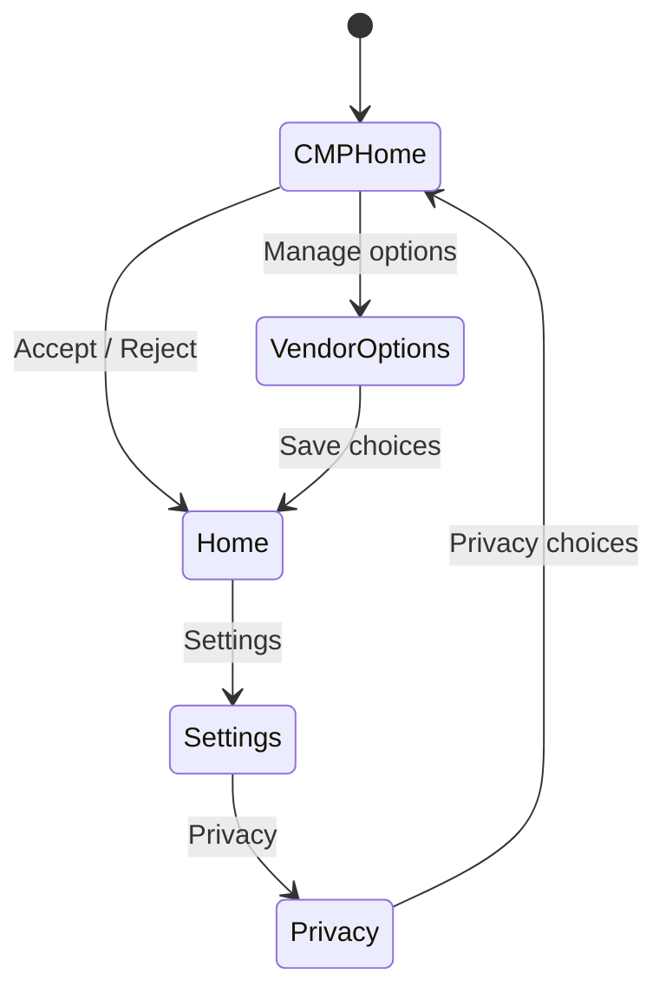

# Android CMP实验App原理

> [!info] 导航
> [[01 当前Python代码完整链路|上一章]] · [[DIULENS 学习总览|返回总览]] · [[03 Appium采集器代码逻辑|下一章]]

## 设计目的

真实第三方App不可控：界面会更新、可能需要登录、可能有反自动化机制，也不应在没有授权时做侵入式测试。因此第一阶段用自建App验证整条方法链。

这个App不是论文目标本身，而是可重复的实验标本。

## 状态机

`dark_pattern` 场景有意删除最后一条返回CMP的边，并把 `Continue` 的真实效果设置为接受全部。

## 三类证据

### UI证据

XML布局为可点击控件提供固定resource-id。Appium读取的页面源会包含文本、ID、可点击状态和坐标。

### 路径证据

Appium记录：当前页面指纹、所点元素、目标页面指纹和截图。多步路径用于验证用户能否重新进入CMP。

### 时间事件

`EvidenceLog` 把事件写入带JSON的Logcat。当前阶段这是受控自报告；Frida阶段将从App外部Hook相同的数据访问API。

## 为什么FakeAnalytics读取Android ID

它具备三个教学优点：

- 是具体的设备标识符访问，不只是打印一行“发生访问”。
- 不需要把数据上传网络。
- 后续可以用Frida Hook `Settings.Secure.getString`，把自报告替换为外部观测。

## 四个场景怎样对应规则

| 场景 | 被改变的事实 | 预期风险 |
|---|---|---|
| compliant | CMP先出现，披露一致，可撤回，标签明确 | 无已知风险 |
| early_access | SDK读取发生在首次CMP显示之前 | DIU-1 |
| sdk_mismatch | FakeAnalytics存在但供应商页不披露 | DIU-2 |
| dark_pattern | 无法重开CMP，Continue实际接受全部 | DIU-3、DIU-4 |

## 学习实验

1. 在 `MainActivity.onCreate` 中找出DIU-1由哪两行的先后顺序形成。
2. 找出 `sdk_mismatch` 只改变披露页面而没有删除FakeAnalytics代码的原因。
3. 给dark pattern恢复隐私选择按钮，预测DIU-3如何变化。
4. 把Continue改回Accept all，预测DIU-4如何变化。

完成后，你应能解释：同一个程序结构可以通过改变时间、披露内容和可达路径，分别构造不同的隐私风险。
