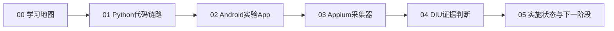

---
aliases:
  - DIULENS学习主页
tags:
  - 论文阅读
  - 移动安全
  - 隐私
  - CMP
  - DIULENS
cssclasses:
  - diulens-study
---

# DIULENS 学习总览

> [!abstract] 学习目标
> 从“能运行Demo”推进到“能解释证据链、能修改代码、能复现实验、能回答老师追问”。论文主题为移动端同意管理平台（CMP）的隐私风险分析。

## 推荐学习顺序



## 论文原文与专题入口

- 主论文阅读卡：[[2026-DIULENS-移动CMP隐私风险]]
- 论文逐节中文精读：[[00 原文精读总览]]
- 英文原文：[[附件/论文原文/DIULENS-英文原文-IEEE-SP-2026.pdf]]
- 中文学习译稿：[[附件/论文译文/DIULENS-中文学习译稿.pdf]]
- 供应链与 LLM 专题手册：[[00 专题学习总览]]

### 第一轮：理解全貌

- [ ] [[00 学习地图]]
- [ ] 能口述 CMP、SDK、consent signal 的关系
- [ ] 能画出“静态分析＋Appium＋Frida＋LLM”的分工图

### 第二轮：读懂程序

- [ ] [[01 当前Python代码完整链路]]
- [ ] [[02 Android CMP实验App原理]]
- [ ] 能解释 `CaseEvidence → PreparedEvidence → AnalysisReport`
- [ ] 能解释四个Android场景如何制造不同风险

### 第三轮：掌握自动探索

- [ ] [[03 Appium采集器代码逻辑]]
- [ ] 能解释页面指纹、点击排序、延迟交互和重启续探
- [ ] 能从一次 `runs/<run-id>` 记录还原完整导航过程

### 第四轮：形成论文表达

- [ ] [[04 四条DIU规则如何根据证据判断]]
- [ ] [[05 当前实施状态与下一阶段]]
- [ ] 能区分 `YES / NO / UNKNOWN`
- [ ] 能说明当前Demo与论文完整系统的差距

## 一次学习循环

> [!tip] 每章建议采用“读—跑—改—讲”四步
> 1. 阅读章节并整理3个关键词。
> 2. 找到对应代码或运行记录。
> 3. 修改一个最小变量，预测并验证结果。
> 4. 不看资料，用3分钟向自己讲清楚。

## 课堂演示主线

```text
Android测试App
→ Appium读取UI树并点击
→ 保存截图、XML、路径和事件
→ Assembler生成CaseEvidence
→ 本地规则或多模态LLM分析
→ 输出四条DIU判断及具体证据
```

## 重点术语入口

- CMP、consent signal、SDK：[[00 学习地图]]
- Pydantic数据合同、Provider模式：[[01 当前Python代码完整链路]]
- 状态机、FakeAnalytics：[[02 Android CMP实验App原理]]
- Appium、页面指纹、DFS：[[03 Appium采集器代码逻辑]]
- DIU-1至DIU-4、UNKNOWN：[[04 四条DIU规则如何根据证据判断]]
- 已完成与待完成：[[05 当前实施状态与下一阶段]]

## 我的学习记录

### 仍不理解的问题

- 

### 可以向老师提出的问题

- 

### 下一次动手实验

- 

---

源资料位于 `D:\Projects\研讨厅\docs`。本专题是便于Obsidian学习的副本，代码更新后需同步相应章节。
