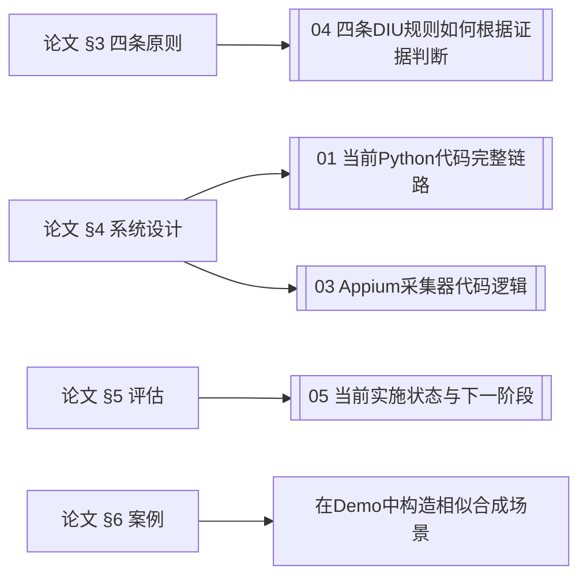

# DIULENS 原文精读总览

> [!abstract] 这一组笔记是什么
> 将课程论文的中文学习译稿按论文原始章节拆开，保留图表与前后导航，适合在 Obsidian 中逐节批注。它与 [[DIULENS 学习总览]] 的区别是：这里以**论文原文结构**为主，后者以**代码和 Demo 学习顺序**为主。

## 原始资料

- 英文正式稿：[[附件/论文原文/DIULENS-英文原文-IEEE-SP-2026.pdf]]
- 中文学习译稿：[[附件/论文译文/DIULENS-中文学习译稿.pdf]]
- 论文阅读卡：[[2026-DIULENS-移动CMP隐私风险]]
- 代码与 Demo：[[DIULENS 学习总览]]

> [!warning] 引用边界
> Markdown 中文内容用于理解和批注，并非官方译本。英文题目、术语、实验数字和原句引用应回到英文 PDF 复核。

## 第一遍：90 分钟抓住论文主线

如果你希望有人按零基础节奏逐步提问和检查，先进入 [[专题学习/四篇精读论文零基础路线/09 DIULENS六步原文伴读]]。

1. [[01 摘要与论文信息]]：用一句话写出问题、方法和结论。
2. [[02 引言]]：找出作者声称的研究空白与三项贡献。
3. [[04 四条DIU原则]]：为每条规则各写一个具体 App 例子。
4. [[05 DIULENS系统设计]]：重点看图3，区分静态、动态、Appium、LLM 与人工。
5. [[06 实验与评估]]：只看 RQ1、RQ2、Ground Truth 和基线。
6. [[07 真实世界DIU风险测量]]：看表1和四类案例，不要先背所有数字。
7. [[08 讨论]]与[[10 结论]]：整理局限和可扩展方向。

## 第二遍：按章节精读

| 顺序 | 笔记 | 读完应回答的问题 |
|---:|---|---|
| 1 | [[01 摘要与论文信息]] | 论文到底检测什么，不检测什么？ |
| 2 | [[02 引言]] | 为什么移动 CMP 不能直接套用网站研究？ |
| 3 | [[03 背景]] | CMP、Consent Signal、TCF、SDK 的关系是什么？ |
| 4 | [[04 四条DIU原则]] | 四条规则分别需要哪些证据？ |
| 5 | [[05 DIULENS系统设计]] | 每个模块的输入、输出、失败模式是什么？ |
| 6 | [[06 实验与评估]] | RQ1/RQ2 的 Ground Truth 怎样构造？ |
| 7 | [[07 真实世界DIU风险测量]] | 397 个风险 App 如何分布，典型根因是什么？ |
| 8 | [[08 讨论]] | 自动系统不能下哪些法律结论？ |
| 9 | [[09 相关工作]] | DIULENS 相比网站 CMP、GUI 测试、移动隐私研究新在哪里？ |
| 10 | [[10 结论]] | 能否用三句话收束论文？ |
| 11 | [[11 致谢]] | 可略读。 |
| 12 | [[12 参考文献]] | 用于追踪 PICOSCAN、GUI 测试与隐私基础文献。 |
| 13 | [[13 附录A图示]] | 提示词和案例图能否支撑正文判断？ |
| 14 | [[14 附录B元数据]] | 记录翻译稿与元数据。 |
| 15 | [[15 附录C作者回应]] | 作者如何界定问题与证据边界？ |

## 每节统一批注模板

在每一页底部追加：

```markdown
## 我的理解
- 本节一句话：
- 输入/处理/输出：
- 最关键证据：
- 我仍不理解：
- 可用于课堂的一句话：
```

## 与 Demo 对照阅读



## 完成标准

- [ ] 能画出 DIULENS 四阶段流程，不看笔记。
- [ ] 能解释四条 DIU 规则为何互补、证据分别是什么。
- [ ] 能区分“集成 SDK”“调用隐私 API”“实际访问数据”。
- [ ] 能解释 84.8%、94.1%、60.5% 的分母和意义。
- [ ] 能指出当前 Demo 与论文系统至少五项差距。
