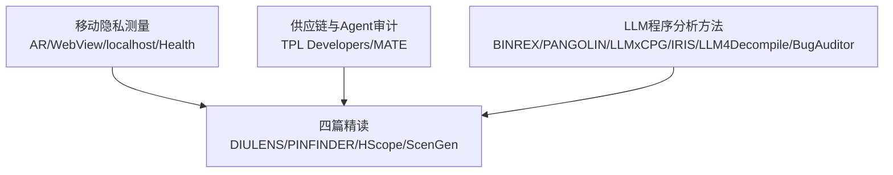

# 十二篇泛读论文学习总览

> [!abstract] 泛读目标
> 泛读不是把论文“读得浅”，而是快速建立研究地图：20–30 分钟内说清论文解决什么、采用什么证据、与四篇精读有什么联系，以及是否值得以后升级为精读。

## 本次确定的 12 篇

### A组：移动隐私与供应链

1. [[论文库/2026-MATE-移动智能体策略感知安全审计|MATE]]
2. [[论文库/2026-CCSTPLDevelopers-移动第三方库开发者隐私合规实践|TPL Developers]]
3. [[论文库/2026-AndroidARPrivacy-安卓AR数据访问隐私风险|Android AR Privacy]]
4. [[论文库/2026-PlainTextPlainRisks-AndroidWebView明文风险|Plain Text, Plain Risks]]
5. [[论文库/2026-BridgesToSelf-移动端localhost静默追踪|Bridges to Self]]
6. [[论文库/2026-HealthHazard-HealthConnect隐私风险|Health Hazard]]

学习页：[[专题学习/十二篇泛读论文路线/01 移动隐私与供应链六篇]]

### B组：LLM与程序分析

7. [[论文库/2026-BINREX-智能体静态二进制分析|BINREX]]
8. [[论文库/2026-PANGOLIN-LLM驱动IoT固件模糊测试|PANGOLIN]]
9. [[论文库/2025-LLMxCPG-CPG引导漏洞检测|LLMxCPG]]
10. [[论文库/2025-IRIS-LLM辅助静态漏洞分析|IRIS]]
11. [[论文库/2024-LLM4Decompile-大模型反编译|LLM4Decompile]]
12. [[论文库/2026-BugAuditor-不一致防御代码审计|BugAuditor]]

学习页：[[专题学习/十二篇泛读论文路线/02 LLM与程序分析六篇]]

## 它们怎样包围四篇精读



- A组补“研究对象和真实风险”：不同数据、平台和供应链中，如何取得运行证据。
- B组补“方法工具箱”：怎样压缩代码上下文、生成规格、调用确定性工具并验证模型结论。

## 统一的25分钟泛读法

|      时间 | 动作           | 只回答什么              |
| ------: | ------------ | ------------------ |
|   0–3分钟 | 读标题、摘要、一句话结论 | 研究对象和问题是什么？        |
|   3–8分钟 | 看总览图或方法首图    | 输入、处理、输出是什么？       |
|  8–14分钟 | 看一张结果表和关键数字  | 作者用什么证据证明有效？       |
| 14–18分钟 | 看局限          | 哪些结论不能外推？          |
| 18–23分钟 | 与一篇精读论文对比    | 能补哪一段证据或方法？        |
| 23–25分钟 | 合上论文口头复述     | 一句话、一个方法、一个数字、一个局限 |

## 每篇只留下“五格卡”

```text
问题：它想解决什么？
方法：最核心的一条链路是什么？
证据：最值得记的一个结果或案例是什么？
边界：它不能证明什么？
连接：它与哪篇精读论文最接近？
```


后续使用：[[专题学习/十二篇泛读论文路线/03 十二篇横向对比与汇报选材]]、[[专题学习/十二篇泛读论文路线/04 泛读记录模板与四周计划]]。

