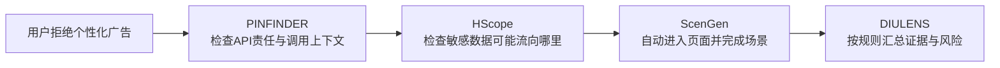

# 四篇精读论文学习总览


- **DIULENS检查“用户看到的同意界面是否可信”；**
- **PINFINDER检查“用户选择进入代码和SDK后，是否被正确执行”。**
- **HScope 是“给 App 做代码层面的 X 光”**：不运行 App，也能寻找敏感数据可能流向哪里。
- **ScenGen 是“会看屏幕、会操作、会纠错的机器人测试员”**：运行 App，按照真实业务目标一步步完成操作。


## 论文原文


## 四篇论文为什么放在一起

使用同一个**受控合成案例**：

> 一款儿童游戏 App 集成了广告 Wrapper 和底层广告 SDK。用户在隐私界面选择“拒绝个性化广告”。我们要判断：选择有没有传给 SDK、敏感标识符是否仍可能流向网络、是否能自动找到设置入口，以及最后能否形成可复核的合规结论。




| 论文                                               | 用一句大白话解释                                 | 在案例中的问题                |
| ------------------------------------------------ | ---------------------------------------- | ---------------------- |
| [[论文库/2026-DIULENS-移动CMP隐私风险\|DIULENS]]          | 把静态、运行时和界面证据拼起来，检查同意管理是否真的可用且一致          | 拒绝是否及时、完整、可撤回且效果清楚     |
| [[论文库/2026-HScope-OpenHarmony细粒度隐私泄漏检测\|HScope]] | 不运行 App，沿代码关系追踪敏感数据是否可能到达危险出口            | 设备标识符是否可能到达网络发送函数      |
| [[论文库/2026-ScenGen-场景引导移动GUI测试\|ScenGen]]        | 让智能体按测试场景看界面、点控件、检查是否完成，并留下可重放记录         | 如何自动找到隐私设置并完成“拒绝”操作    |
| [[论文库/2026-PINFINDER-SDK隐私上下文一致性\|PINFINDER]]    | 检查 App/Wrapper 有没有按 SDK 的隐私 API 说明正确传递配置 | 谁应该调用“关闭个性化”API，调用得对不对 |

| 问题      | DIULENS                 | PINFINDER                       |
| ------- | ----------------------- | ------------------------------- |
| 主要对象    | CMP同意界面                 | SDK隐私API与供应链                    |
| 主要视角    | 用户看到和操作什么               | 代码怎样传播和执行选择                     |
| 核心规则    | 时机、披露、撤回、效果             | Correct-Use、Triggering、Behavior |
| 关键证据    | CMP截图、导航路径、SDK集合、数据访问时间 | 文档、API调用、参数、调用链、数据访问和网络         |
| LLM主要作用 | 找CMP、探索页面、理解按钮与披露       | 读SDK文档、整理上下文、拆规则、查一致性           |
| 最终回答    | CMP有没有有效同意风险            | 哪个SDK API漏调、错调或没有生效             |


| 问题         | HScope             | ScenGen            |
| ---------- | ------------------ | ------------------ |
| 分析对象       | OpenHarmony安装包和字节码 | 正在运行的移动App界面       |
| 是否运行App    | 不需要                | 需要                 |
| 是否使用LLM    | 不使用                | 使用                 |
| 核心技术       | 抽象解释、调用图、污点分析      | 多模态LLM、GUI探索、ADB执行 |
| 主要输出       | Source到Sink的候选泄漏路径 | 截图、动作轨迹和可回放脚本      |
| 能看到未执行路径吗  | 可能看到               | 看不到                |
| 能证明按钮真的点了吗 | 不能                 | 能                  |
| 能判断数据流向哪里吗 | 能分析潜在路径            | 单独不能               |
| 主要风险       | 误报和漏报              | 点错、走偏、误判完成         |

## 第一篇：DIULENS

### 1. 它想解决什么问题？

很多App装了CMP（Consent-Management Platform，同意管理平台），开发者可能觉得：

> “我已经放了同意弹窗，隐私合规应该没问题了。”

但实际可能是：

- 弹窗出现前，广告SDK已经读取了设备标识符；
- App实际集成了10个SDK，界面只披露3个；
- 用户只能同意，拒绝按钮藏得很深；
- 用户以后找不到撤回入口；
- 按钮写着“继续游戏”，实际上等于“全部同意”。

所以DIULENS研究的是：

> **安装一个正规CMP，是否真的能让移动App获得有效的用户同意？**

### 2. CMP是什么？

CMP不是普通的登录用户协议。

普通协议可能只有：

```
我已阅读并同意用户协议
```

CMP通常允许用户管理数据处理，例如：

```
个性化广告       开/关
统计分析         开/关
广告合作伙伴     查看列表
全部接受
全部拒绝
保存选择
```

它可能在首次启动时出现，也可能藏在：

```
设置 → 隐私 → 隐私选择
```

### 3. DIULENS检查哪四件事？

这里的DIU指CMP的 **Design、Implementation and Use，即设计、实现和使用**。

#### DIU-1：时机对不对？

> 是先询问用户，还是先收集数据？

风险例子：

```
SDK读取广告ID
→ 3秒后CMP才出现
```

即使用户最后点了拒绝，之前的数据访问已经发生。

证据：

- CMP首次出现的时间；
- SDK访问个人数据的时间；
- 两者的先后顺序。

#### DIU-2：披露可信吗？

> 界面告诉用户的SDK和用途，与App真实集成的一致吗？

风险例子：

```
真实集成：Facebook、Firebase、AppLovin
CMP披露：Facebook
```

证据：

- 静态分析识别出的SDK；
- CMP各层页面里的供应商列表；
- 不同页面之间的披露数量。

#### DIU-3：能拒绝、能撤回吗？

> 用户能否不受强迫地拒绝，并在以后修改选择？

风险例子：

- 只有“接受”，没有同等明显的“拒绝”；
- 拒绝按钮藏在多层页面；
- 设置里找不到重新进入CMP的入口；
- 非必要广告SDK被标成“必需”。

#### DIU-4：点击效果清楚吗？

> 按钮写的意思和实际代表的同意效果是否一致？

风险例子：

```
按钮文字：Tap to Play
实际效果：接受全部广告用途
```

注意：DIULENS主要根据界面、导航和点击后页面变化判断“效果是否明确”，并结合运行事件；它不是完整读取所有SDK内部同意状态的形式化验证器。

### 4. 系统怎样工作？

```
App、CMP和SDK数据
        ↓
静态分析识别真实CMP和SDK
        ↓
Frida记录SDK个人数据访问时间
        ↓
Appium自动操作App、截图、保存路径
        ↓
LLM寻找并探索CMP的多层页面
        ↓
组合SDK、截图、路径和时间事件
        ↓
按四条DIU规则判断风险
        ↓
人工复核
```

工具分工：

- **静态分析**：代码里集成了哪些SDK；
- **Frida**：运行时谁访问了什么数据、什么时候访问；
- **Appium**：替人点击手机、截图、提取界面；
- **LLM**：理解哪个页面是CMP、按钮是什么意思、下一步点哪里；
- **规则和人工**：形成可复查的风险结论。

### 5. 效果怎样？

- 在656个成功显示CMP的App中，397个，即**60.5%**，被报告至少存在一种DIU风险；
- CMP发现评估中，App级覆盖率为**92.2%**，GUI级覆盖率为**84.8%**。

这不表示397个App已经被法律认定违法，只表示系统依据四条规则找到了风险证据。

### 6. DIULENS一句话复述

> DIULENS从用户这一端出发，检查CMP是否出现得及时、说得真实、允许拒绝和撤回，并且按钮效果不误导。


## 第二篇：PINFINDER

### 一、PINFINDER 到底解决什么问题？

先定义一个论文里的重要缩写：

**PIN = Privacy-Noncompliant SDK Integration**

也就是：

> App 在集成第三方 SDK 时产生的隐私不合规问题。

例如一个广告 SDK 提供：

```java
setHasUserConsent(true)
```

文档告诉开发者：

```text
只有用户真正同意以后
才能设置 true
```

结果 App 实际运行：

```text
用户没有点同意

        ↓

App 直接调用：

setHasUserConsent(true)
```

这是一个 PIN。

但是 PIN 不只有这种。

作者总结过去研究后发现，大体存在三类。

|类别|人话理解|例子|
|---|---|---|
|**Misuse**|API 调了，但调错了|用户没同意，却传 `true`|
|**Missing API**|本来该调，却没调|儿童用户出现，却没调用儿童保护 API|
|**Ineffective Implementation**|API 调对了，但 SDK 没做到|调用了“禁止收集”，SDK 仍上传 AAID|

过去的方法往往是：

```text
发现一种问题
↓
为这种问题写一种 detector

发现另一种问题
↓
再写一个 detector
```

例如：

```text
检测未授权上传数据
→ 分析网络流量

检测 consent API 错误
→ 写 consent API 规则

检测儿童 API
→ 再写儿童 API 规则
```

问题就是：

> **每种 PIN 都需要预先知道问题长什么样。**

所以覆盖面不够，而且就算看到“网络上出现了 AAID”，开发者也不一定知道：

> 到底哪个 SDK API 配错了？  
> 应该补调用哪个 API？  
> 为什么会发生？

作者因此想做一个更通用的东西。

---

### 二、PINFINDER 最核心的一句话

PINFINDER 把问题变成：

```text
SDK 文档告诉我的
“应该发生什么”
          ↓
          ↓ 比较
          ↓
App 实际运行过程中
“真正发生了什么”
```

如果：

```text
应该发生的
≠
实际发生的
```

那么：

```text
Privacy-Contextual Inconsistency
           ↓
         PIN
```

所以你可以把 PINFINDER 理解成一个：

> **“SDK 隐私规范 vs App 真实执行”的自动对账系统。**

---

### 三、整个 PINFINDER 其实就三个大模块

论文 Figure 2 的结构其实非常清晰：

```text
       SDK文档 + SDK代码
                │
                ▼
┌────────────────────────┐
│ ① API Privacy Modeler  │
│                        │
│ 搞明白SDK隐私API        │
│ “应该怎么用”            │
└───────────┬────────────┘
            │
      API Privacy
      Descriptions
            │
            ▼
       APK + App运行
            │
            ▼
┌────────────────────────┐
│ ② PCTrace Builder      │
│                        │
│ 记录App真实隐私上下文    │
│ “实际上发生了什么”      │
└───────────┬────────────┘
            │
          PCTrace
            │
            ▼
┌────────────────────────┐
│ ③ PIN Detector         │
│                        │
│ 比较“应该”和“实际”      │
│ 找不一致                │
└───────────┬────────────┘
            │
            ▼
       PIN + 原因
```

真正应该把握的是这三句话：

> **Modeler 建规则。**  
> **Builder 收证据。**  
> **Detector 对规则和证据。**

下面逐个拆。

---

### 四、第一部分：API Privacy Modeler

这个模块回答：

> **这个 SDK 的隐私 API 到底是什么意思？**

例如 SDK 有：

```java
setIsAgeRestrictedUser(true)
```

光看到方法名其实是不够的。

PINFINDER 希望搞清楚至少四件事情：

```text
① 参数是什么？

② 什么情况下这样调用才是正确的？

③ 什么情况下必须调用？

④ 调用以后 SDK 应该发生什么行为？
```

作者把一个隐私相关 SDK API，也就是 **PSAPI（Privacy-Sensitive API）**，形式化成：

A={(θi,Pi,Mi,Bi)}A=\{(\theta_i,P_i,M_i,B_i)\}

别被这个公式吓到。

其实就是：

```text
θ = 参数

P = Proper/Correct-use conditions
    正确使用条件

M = Mandatory/Triggering conditions
    触发条件

B = Expected Behaviors
    预期行为
```

论文正式定义就是这几个部分。

---

#### 举个例子

假设：

```java
setAgeRestrictedUser(true)
```

文档说：

> 如果用户属于儿童，则在 SDK 初始化之前设置该标记；设置后 SDK 不应收集儿童个人信息。

Modeler 最后希望得到类似：

```text
API:
setAgeRestrictedUser

θ:
true

P 正确使用条件:
必须在 SDK 初始化前调用

M 触发条件:
当前用户是儿童

B 预期行为:
不得收集儿童个人数据
不得进行个性化广告
```

于是原本一大段自然语言 SDK 文档，被变成了一份：

> **机器能够进行一致性检查的 API Privacy Description。**

---

### 五、这里为什么需要 LLM？

因为 SDK 文档通常不会写得这么规整。

可能写成：

> When enabled, only contextual advertisements will be displayed.

而不直接说：

```text
DO NOT perform targeted advertising
```

或者：

> Subject to COPPA

这种东西本身就是法律/隐私概念。

传统字符串匹配很难把它理解成：

```text
儿童
→ 禁止个性化广告
→ 禁止某些数据收集
```

因此作者让 LLM 从 SDK 隐私文档里：

```text
找到隐私敏感 API
        ↓
理解参数含义
        ↓
理解什么时候应该调用
        ↓
理解怎么调用
        ↓
理解调用后应该有什么效果
```

最终输出结构化 JSON 风格的 API Privacy Description。

但作者并不是直接把整篇 SDK 文档扔给 LLM。

他们发现这样误差很大。

所以又加了三个东西：

```text
               LLM
                │
       ┌────────┼────────┐
       ↓        ↓        ↓
 Privacy KB   Greedy   Completion
              Extraction Tools
```

#### 1. Privacy Knowledge Base

把：

```text
GDPR
CCPA
COPPA
Google Play Families Policy
```

等隐私知识建立向量知识库。

作用主要是判断：

> 这个 API 真的是隐私 API 吗？

否则 LLM 可能连：

```java
setMuted(true)
```

这种静音 API 都误认为 privacy-sensitive API。

#### 2. Greedy Extraction

不是把整份 SDK 文档一次塞给模型。

而是：

```text
发现 API
↓
先看 API 附近文档
↓
信息不够
↓
扩大上下文
↓
再看
↓
直到 θ、P、M、B 足够完整
```

避免不同 API 的文档上下文互相污染。

#### 3. Privacy Description Completion

如果 SDK 文档自己没写完整：

```text
SDK 文档
   +
SDK AAR/JAR 代码
   +
外部标准资料
```

共同补全。

代码侧使用 Soot 去分析方法签名、参数和条件；论文实现里还允许通过在线搜索补充标准定义。

所以第一阶段最后得到：

```text
SDK Privacy Guidance
SDK Code
Privacy Regulation Knowledge
          │
          ▼
       LLM理解
          │
          ▼
API Privacy Description

API X:
θ = true
P = 必须在初始化之前
M = 用户为儿童时必须调用
B = 禁止收集设备标识符
```

这就是整个系统的**规则库**。

---

### 六、第二部分：PCTrace Builder

接下来问题变成：

> 文档我已经知道了，那 **App 运行的时候到底发生什么？**

PINFINDER 为每次 App 执行构造一个：

#### PCTrace

**Privacy-Context Trace**

也就是：

> 隐私上下文执行轨迹。

论文把它定义为一个按时间组织的 privacy-focused trace。

这里特别重要。

它不是普通程序 trace，只保留跟隐私判断有关的信息。

主要有 **5种上下文**。

---

##### ① Capp：App Privacy Commitments

也就是：

> App 自己承诺了什么。

例如 Google Play Data Safety：

```text
This app doesn't collect user data.

Developer has committed to follow
Play Families Policy.
```

那么 PINFINDER 就记录：

```text
Capp:
App 承诺遵守 Play Families Policy
```

---

##### ② Cenv：运行环境

例如：

```text
用户年龄 = 10
IP所在地区 = California
```

为什么重要？

因为：

```text
成年人
儿童

EU
California
其他地区
```

可能对应不同的隐私要求。

论文实现中特别用不同年龄的 Google 测试账号，并通过 VPN 模拟不同地区。

---

##### ③ Cuser：用户做了什么

例如：

```text
10:01 用户打开 Consent Dialog

10:02 用户点击 Reject

10:03 用户关闭窗口
```

这非常关键。

因为它告诉系统：

> **用户真正的隐私选择是什么。**

论文这里使用 **FastBot** 自动探索 UI，记录：

```text
点击了哪个控件
控件文字
附近文字
页面标题
navigation path
Activity/Class
时间
```

然后 LLM 根据这些东西理解：

```text
用户点击的 OK 到底是什么意思？
```

因为单独一个：

```text
OK
```

没有任何语义。

但如果附近是：

```text
Allow personalized ads?
Reject       OK
```

那意义就完全不同。

---

### 七、④ Capi：SDK API 到底怎么调用了

这个就跟你之前接触的 Frida 很接近了。

PINFINDER 使用：

#### Frida

Hook 第一阶段找到的 PSAPI。

例如：

```java
setHasUserConsent(...)
```

Hook 后记录：

```text
时间:
10:02:31

API:
setHasUserConsent

参数:
true

返回值:
void

Call stack:
App → AppLovin → ...
```

所以系统现在知道：

> App 到底有没有调用这个隐私 API，以及传了什么。

论文明确记录 invocation parameters、return values、call stacks 和 invocation time。

---

### 八、⑤ Cdata：SDK 真正处理了什么数据

这个是用于验证：

> SDK 说自己停止收集了，**真的停了吗？**

作者整理了 73 个系统数据访问 API，覆盖 12 类个人数据。

例如：

```text
AAID
location
network information
...
```

同样使用 Frida Hook。

于是可能得到：

```text
10:04

ironSource 调用系统API

getAdvertisingIdInfo()

得到：
AAID = abc123
```

但：

> **访问 ≠ 上传。**

所以作者又用了：

#### Burp Suite

拦截网络流量。

然后匹配：

```text
系统 API 返回：
AAID = abc123

                 ↓

网络请求：
POST ads.xxx.com
id=abc123
```

于是可以推断：

```text
ironSource

访问 AAID
   ↓
并将 AAID
   ↓
发送给 ads.xxx.com
```

这就是 `Cdata`。

---

### 九、于是一次运行最终可能得到这样一个 PCTrace

原论文形式要复杂得多，但你可以先这么理解：

```text
[App Commitment]

App 承诺遵守 Play Families Policy


[Environment]

当前用户年龄 10 岁


[10:00 User Interaction]

用户在年龄页面选择：
10 years old


[10:01 API]

App 调用：
AppLovin.setIsAgeRestrictedUser(true)


[10:02 API]

AppLovin 初始化 ironSource


[10:03 Data]

ironSource 获取 AAID


[10:04 Network]

ironSource 将 AAID
发送到 xxx.com
```

这时候你已经能感觉到：

> 只要把 SDK 文档描述放到这条 trace 旁边，问题就非常明显。

---

### 十、但是这里出现一个很重要的问题：这些数据格式完全不一样

原始数据可能是：

```text
JSON
Frida log
HTTP packet
UI hierarchy
call stack
Google Play文本
SDK API描述
```

LLM 如果直接看，很乱。

所以 PINFINDER 加了：

#### Semantic Synthesizer

把这些内容全部变成统一的**自然语言隐私事实**。

例如原始：

```text
getAdvertisingIdInfo()
→ 2848-xxx

POST
tracker.example.com
id=2848-xxx
```

转成：

```text
The ironSource SDK accesses
the advertising identifier.

The ironSource SDK collects
the advertising identifier
and transmits it to tracker.example.com.
```

API 则变成：

```text
If the user is a child,
the SDK must call API X
with parameter true.
```

用户行为变成：

```text
The user selected an age indicating
that the user is a child.
```

这样 PCTrace 就变成：

> **一段 LLM 非常容易推理的自然语言时间线。**

这一步其实是 PINFINDER 很聪明的工程设计。

---

### 十一、第三部分：PIN Detector

到这里已经有两样东西：

#### 左边：规范

```text
API Privacy Description

P
M
B
```

#### 右边：现实

```text
PCTrace

Capp
Cenv
Cuser
Capi
Cdata
```

现在就可以对账了。

PINFINDER 只需要检查：

#### 三条通用规则

而这三条规则基本对应最开始那三大类 PIN。

---

#### Rule 1：Correct-Use Rule

问：

> **如果你调用了这个 API，你调用得对不对？**

例如文档：

```text
setHasUserConsent(true)

P:
必须先获得用户同意
```

PCTrace：

```text
10:00 打开APP

10:01
setHasUserConsent(true)
```

却没有：

```text
用户点击 Allow
```

于是：

```text
API被调用
     ↓
检查 P
     ↓
需要“用户已经同意”
     ↓
PCTrace不存在这个证据
     ↓
违反 Correct-Use Rule
     ↓
PIN
```

这主要抓：

#### API Misuse

---

#### Rule 2：Triggering Rule

问：

> **条件已经满足了，本来必须调用的 API 调了吗？**

比如：

```text
M:
如果用户是儿童
→ 必须调用
setDeviceIdOptOut(true)
```

PCTrace：

```text
用户年龄 = 10
```

但是：

```text
没有调用
setDeviceIdOptOut(true)
```

那么：

```text
M 已经成立

     ↓

API invocation obligatory

     ↓

但是 Capi 中没有

     ↓

违反 Triggering Rule

     ↓

PIN
```

这主要抓：

#### Missing API

---

#### Rule 3：Behavior Rule

这个非常重要。

问：

> **API 虽然调了，但它承诺的效果真的发生了吗？**

例如：

```text
API:
setAgeRestrictedUser(true)

B:
停止收集 device identifier
```

真实 PCTrace：

```text
10:00
setAgeRestrictedUser(true)

10:03
SDK accesses AAID

10:04
SDK sends AAID → server
```

那么：

```text
API说：
我不收集 AAID

       VS

实际：
仍然获取 + 上传 AAID

       ↓

违反 Behavior Rule

       ↓

PIN
```

这就能发现：

#### Ineffective API Implementation

而这个很关键，因为它甚至可能：

> **不是 App 开发者调错了，而是 SDK 自己实现有问题。**

---

### 十二、所以三条规则可以这样死死记住

这是我最建议你记的一张表：

|PIN 类型|PINFINDER 问什么|对应规则|
|---|---|---|
|API 用错|**你调得对吗？**|Correct-Use|
|API 漏调|**你该调的时候调了吗？**|Triggering|
|API 无效|**调完以后真的有效吗？**|Behavior|

也就是：

```text
P：用得对不对

M：该不该用

B：用了有没有效果
```

如果你把：

#### P / M / B

真正搞懂，PINFINDER 的理论核心基本就懂了一半。

---

### 十三、那最后的 LLM 到底负责什么？

这里很容易产生一个误解：

> “是不是直接把 APK 给 GPT，让 GPT 判断合规？”

**完全不是。**

真正流程是：

```text
程序分析/动态分析
负责：
“获取事实”
```

例如：

```text
Frida
→ API调用

Burp
→ 网络发送

FastBot
→ 用户交互

Google Play
→ 隐私承诺

APK/Call Graph
→ SDK关系
```

然后：

```text
LLM
负责：
“理解语义 + 推理事实之间的关系”
```

例如：

```text
用户点击“Reject all”
意味着什么？

child-directed treatment
具体意味着什么？

“only contextual ads”
隐含禁止什么行为？

PCTrace 中的事实
是否满足某个 privacy requirement？
```

所以：

> **LLM 并没有替代程序分析，而是坐在程序分析之上做语义推理。**

这一点对理解这篇论文非常重要。

---

### 十四、为什么还有 PCTrace Slice？

这个设计也很重要。

假设一个 App 里面有：

```text
App
├─ Firebase
├─ AdMob
├─ AppLovin
│   └─ ironSource
├─ Facebook
└─ Adjust
```

如果把**所有 SDK 的信息一起丢给 LLM**：

```text
Firebase consent
AdMob consent
AppLovin consent
ironSource child API
Facebook tracking
...
```

很容易出现：

#### Cross-Context Pollution

也就是：

> A SDK 的上下文，被错误地拿去判断 B SDK。

论文自己实验中就遇到了这种问题。

所以他们先分析 App 的调用关系，找：

#### SDK integration chain

比如：

```text
App
 ↓
AppLovin
 ↓
ironSource
```

只抽出这一条链相关的信息：

```text
PCTrace

      ↓ Slice

App
AppLovin
ironSource
```

其他：

```text
Firebase
Facebook
Adjust
```

暂时不让 LLM 看。

这样：

```text
减少 context pollution
+
减少 token
+
减少 LLM 推理难度
```

论文报告，加入 PCTrace slices 和后面要说的 Self-Ask with Search 后，检测 precision 达到 89.6%，相比不使用这些增强时明显提高。

---

### 十五、Self-Ask with Search 又是干什么？

假设文档写：

```text
Enable child-directed treatment.
```

PCTrace 不会直接出现：

```text
child-directed treatment = false
```

它只可能出现：

```text
SDK collected AAID

SDK displayed personalized ads
```

所以 LLM 需要先把大问题：

```text
是否实施了
child-directed treatment？
```

拆成：

```text
① 是否禁止个性化广告？

② 是否禁止设备标识符收集？

③ 是否限制儿童数据处理？
```

然后一个个去 PCTrace 找证据。

这就是作者使用：

#### Self-Ask with Search

做的事情。

也就是说：

```text
抽象隐私概念

child-directed treatment

        ↓ 分解

具体技术要求

禁止个性化广告
禁止identifier收集
...

        ↓

在PCTrace找证据

        ↓

判断是否违反
```

---

### 十六、我们完整跑一次，你就彻底懂了

还是用儿童广告 SDK。

#### Step 1：读 SDK 文档

发现：

```text
ironSource：

如果 App 面向儿童
并遵守 Play Families Policy

必须设置：

is_deviceid_optout = true
```

于是生成：

```text
M:
用户是儿童
+
App遵守Families Policy

→ API必须调用
```

---

#### Step 2：运行 App

设置：

```text
测试Google账号：
10岁
```

FastBot 操作 App。

得到：

```text
Cenv:
当前用户10岁

Cuser:
用户在年龄页面选择10岁
```

---

#### Step 3：获取 App 承诺

Google Play：

```text
App committed to follow
Play Families Policy
```

得到：

```text
Capp:
遵守 Families Policy
```

---

#### Step 4：Frida 看 API

得到：

```text
App
 ↓
AppLovin
 ↓
ironSource

调用了：
is_child_directed=true
```

但是没有：

```text
is_deviceid_optout=true
```

---

#### Step 5：检查 Triggering Rule

规则：

```text
儿童
+
Families Policy
       ↓
必须：
deviceid_optout=true
```

现实：

```text
儿童 ✓

Families Policy ✓

deviceid_optout
没有 ✗
```

所以：

```text
Triggering condition satisfied
          +
required API missing

          ↓

          PIN
```

而且系统不仅告诉开发者：

> “你的 App 在上传 AAID。”

还可以进一步告诉：

> **AppLovin → ironSource 这条 SDK integration chain 中缺少 ironSource 的 `is_deviceid_optout=true` 配置。**

这就是这篇论文比单纯网络流量检测更有价值的地方之一：**能往开发者真正应该修改的 integration API 靠近。**

---

### 十七、把整篇 PINFINDER 压缩成一张图

你以后汇报论文甚至可以直接按这个逻辑讲：

```text
                PINFINDER
                    │
        ┌───────────┴───────────┐
        │                       │
    “应该怎样”               “实际上怎样”
        │                       │
        ▼                       ▼

 SDK Privacy Docs             APK
 SDK Code                      │
 Privacy Laws                  ▼
        │                Dynamic Analysis
        │                       │
        ▼             ┌─────────┼─────────┐
 API Privacy          UI       API       Data
 Modeler            FastBot   Frida     Frida/Burp
        │             │        │          │
        ▼             └────────┼──────────┘
 θ 参数                        │
 P Correct-use                 ▼
 M Triggering                PCTrace
 B Behavior                    │
        │                      │
        └──────────┬───────────┘
                   ▼
            PCTrace Slicing
                   │
                   ▼
            LLM + Self-Ask
                   │
       ┌───────────┼───────────┐
       ▼           ▼           ▼
 Correct-use   Triggering   Behavior
   Rule           Rule        Rule
       │           │           │
       └───────────┼───────────┘
                   ▼
         Privacy Inconsistency
                   │
                   ▼
                  PIN
                   │
                   ▼
          原因 + SDK/API定位
```

---

### 十八、你现在读这篇论文最应该抓住的“灵魂”

不要把 PINFINDER 理解成：

> **“一个 LLM 检测隐私违规的工具。”**

这种理解太浅了。

它真正的创新逻辑是：

> **把原本很多不同类型的 SDK 隐私违规，统一抽象成“API Privacy Implication 与 Privacy Context 之间的一致性问题”。**

然后设计三层东西：

```text
API Privacy Description
          +
PCTrace
          +
Privacy-Contextual Consistency Rules
```

LLM 只是让这套抽象**能够在复杂自然语言隐私语义上落地**。

所以从论文研究贡献角度，我会把它理解成：

```text
最核心：
Privacy-Contextual Consistency
新的问题抽象 / 检测范式

其次：
API Privacy Description + PCTrace
把这个抽象表示出来

再其次：
PINFINDER
把这个范式工程实现

最后：
LLM / Frida / FastBot / Burp / Soot
实现各模块所使用的技术
```

这个层级关系非常重要。否则很容易读成：

> “作者用了 GPT + Frida + Burp 检查 SDK。”

那就没有真正读懂这篇论文。

如果你接下来要继续精读这篇，我建议下一步直接攻 **§3.3 的三个模型和公式**。尤其是 `A={(θi, Pi, Mi, Bi)}` 和 `PCTrace`，我可以下一条把这两个公式从数学符号开始，拿一个真实 SDK API **逐项代入推一遍**，你会更容易理解作者为什么这么定义。


## 第三篇、HScope：不运行 App，检查隐私数据会流向哪里

### 1. 它解决什么问题？

OpenHarmony 应用主要编译成一种叫 **Ark 字节码**的形式。它有三个让传统分析工具头疼的特点：

1. 很多类型信息在编译后消失；
2. 按钮事件、匿名函数和回调大量存在，真正调用哪个函数不容易判断；
3. 父组件和子组件能共享变量、对象甚至函数。

所以传统分析器可能看到：

```
OAID被读取了
http.post发送数据了
```

却无法证明二者之间存在连接。

HScope 要回答的是：

> 某个敏感数据从哪里进入程序，经过哪些变量、对象、组件和回调，最后有没有进入网络、日志等危险出口？

### 2. 用一个具体例子理解

假设一个 OpenHarmony App 有两个组件：

```
父组件 C1：
点击文字 → 读取 OAID → 保存到 message

子组件 C2：
点击按钮 → callback(message)

callback 实际由父组件提供：
callback → request(message) → http.post(message)
```

真正的数据流是：

```
identifier.getOAID()
        ↓
C1.message
        ↓ 组件共享状态
C2.message
        ↓
callback(message)
        ↓ 间接调用
request(message)
        ↓
http.post(message)
```

普通工具容易在“组件共享”和“间接回调”处断掉。HScope 的核心价值，就是把这些断开的边重新连接起来。

### 3. HScope 是怎么实现的？

可以把系统拆成六步。

#### 第一步：拆开安装包

使用 `ark_disasm` 把 App 中的 Ark 字节码反汇编成可分析的指令。

相当于：

> 先把机器能执行、但人和分析器很难理解的内容拆开。

#### 第二步：转换为 IR

HScope 把复杂字节码变成少量统一操作：

```
变量赋值
读取对象属性
写入对象属性
调用函数
创建对象
条件跳转
返回结果
```

IR 就像把不同方言都翻译成一种“程序分析普通话”。

#### 第三步：抽象解释

HScope 不真正运行程序，而是在内存中模拟：

- 变量可能指向什么对象；
- 对象的某个属性可能是什么；
- 某个回调变量可能指向哪个函数；
- 闭包捕获了哪些变量。

例如它会推断：

```
C2.callback → C1中定义的匿名函数
C2.message → 与C1.message共享状态
```

这种“近似模拟程序执行”的方法就叫**抽象解释**。

#### 第四步：边分析边构建调用图

传统方法往往先构建完整调用图，再分析数据流。

但 Ark 字节码动态性很强，很难提前知道所有调用目标。因此 HScope 是：

```
分析到 this.callback()
        ↓
查看 callback 当前可能指向哪些函数
        ↓
找到 C1 的匿名函数
        ↓
把这条调用边加入调用图
        ↓
继续分析匿名函数
```

这叫 **on-the-fly call graph construction**，即“边分析边建调用图”。

#### 第五步：专门理解 OpenHarmony 框架

HScope额外建立了 OpenHarmony 专用规则，包括：

- Ability 之间传参；
- Router 页面跳转；
- 父子组件状态共享；
- `@Link`、`@Provide`、`@Consume` 等状态机制；
- 回调和闭包。

这是它优于通用静态分析器的关键。

#### 第六步：污点分析

先定义两类 API：

```
Source：敏感数据进入程序
例如 getOAID()、getLocation()、getContacts()

Sink：数据可能离开安全边界
例如 http.post()、console.log()、sendSms()
```

然后给敏感数据贴标签并追踪：

```
OAID标签
  → message
  → 子组件共享变量
  → callback参数
  → http.post
```

如果标签最终到达 Sink，就报告一条**候选隐私泄漏路径**。

### 4. 效果怎么样？

论文使用了两组实验：

- 在包含50个测试用例的 OH-Bench 上，Precision 和 Recall 都是 **87.5%**，F1 为 **0.88**；
- 对比工具 ArkAnalyzer 的 Recall 只有 **22.5%**；
- 分析300个 OpenHarmony App，发现48条候选路径；
- 人工确认其中39条可行，涉及27个 App；
- 39条中有32条流向日志，7条流向网络；
- 平均每个 App 分析约206秒。

注意：

> “静态路径可行”不等于“用户手机上已经发生泄漏”。

因为静态分析会保守地考虑多种可能路径，其中某些路径在现实中可能因为条件限制而不会执行。

HScope原文：HScope-英文原文-ISSTA-2026.pdf

### 5. HScope 的贡献，用人话概括

1. 提出了一套直接分析无类型 Ark 字节码的方法；
2. 能识别动态回调、闭包和跨组件共享状态；
3. 将这些能力与污点分析结合，检测真实 OpenHarmony App 的隐私数据流；
4. 建立了包含50个用例的 OH-Bench，并在300个 App 上进行了验证。

### 6. HScope 做不到什么？

- 不会自动点击 App；
- 看不到真实网络包；
- 无法证明某条路径一定会在现实中触发；
- 反射、动态加载等行为可能造成漏报；
- 对对象字段的保守近似可能造成误报；
- 它检测的是数据流，不直接判断 GDPR 或用户同意是否合法。

---

## 第四篇、ScenGen：让 AI 像测试员一样完成整个业务流程

### 1. 它解决什么问题？

传统自动化测试常见目标是：

```
尽量多点击
尽量多访问页面
尽量提高代码覆盖率
```

但“点得多”不等于“完成了有意义的业务流程”。

例如你要求测试：

> 打开隐私设置，拒绝个性化广告，然后保存并返回首页。

Monkey 可能点击了100次，却一次都没有完整完成这个流程。

ScenGen要解决的是：

> 给定一个自然语言业务场景，让系统自己看懂界面、决定下一步、准确操作、判断是否成功，并保存可回放的脚本。

### 2. 用一个例子理解

输入场景：

```
打开App
进入隐私设置
关闭个性化广告
点击保存
确认设置已经生效
```

ScenGen会不断循环：

```
看当前屏幕
→ 判断下一步该做什么
→ 找到对应按钮
→ 执行点击
→ 检查页面是否真的变化
→ 记录证据
→ 继续下一步
```

### 3. 五个模块分别干什么？

#### Observer：眼睛

负责看懂当前界面。

它会结合：

- 截图；
- CV 检测到的控件边界；
- OCR 识别到的文字；
- 多模态大模型理解到的语义。

最后给控件画框并编号：

```
控件 1：返回
控件 2：隐私设置
控件 3：个性化广告开关
控件 4：保存
```

这样可以避免让大模型直接猜坐标。

#### Decider：大脑

根据以下信息决定下一步：

- 测试目标；
- 当前界面；
- 已经执行过的动作；
- Observer 给出的控件列表。

例如：

```
当前目标：进入隐私设置
当前界面存在“隐私设置”，编号为2
决策：点击控件2
```

它先决定“逻辑上做什么”，再决定“具体操作哪个控件”。

#### Executor：手

它不负责思考，只执行确定性命令，例如：

```
adb shell input tap 530 820
adb shell input text "test@example.com"
adb shell input swipe 500 1500 500 500
```

把“思考”和“执行”拆开，可以减少大模型输出错误坐标或错误命令的问题。

#### Supervisor：监考老师

点击后不能直接相信操作成功，Supervisor 会检查：

1. 页面是否还在加载；
2. 界面是否发生有意义的变化；
3. 当前步骤是否完成；
4. 整个测试场景是否完成。

如果点击没有效果，它会判断可能是：

- 控件定位错误；
- 页面还没加载完成；
- 缺少前置操作；
- Decider 的逻辑决策错误；
- 弹窗或广告挡住了目标。

然后要求重新定位、重试或回滚。

#### Recorder：书记员

保存：

- 操作前后的截图；
- 识别到的控件；
- Decider 的动作；
- 实际 ADB 命令；
- 页面变化；
- 日志；
- 成功的完整轨迹。

最终生成可以重复执行的 JSON 测试脚本。

### 4. 它真的是五个 LLM 吗？

不是。

更准确地说：

- Observer、Decider、Supervisor 会使用大模型；
- Executor 是确定性命令执行器；
- Recorder 是普通记录程序；
- CV、OCR、控件合并和坐标计算也主要是传统算法。

所以它不是“五个 AI 自己聊天”，而是：

> 大模型负责理解和判断，普通程序负责准确执行和记录。

### 5. 效果怎么样？

论文测试了：

- 92个移动 App；
- 99个 App—场景任务；
- 10类测试场景。

主要结果：

- 场景覆盖率：**86.87%**；
- 场景成功率：**84.85%**；
- 控件定位准确率经过纠正后，从 **80.79%** 提升到 **97.96%**；
- 平均生成一个场景测试约 **4.71分钟**；
- 发现106个与测试场景相关的 Bug/崩溃；
- 其中 **83.02%** 得到开发者确认或修复。

这里的106个 Bug 主要是运行日志中发现的崩溃，不应讲成“106个安全漏洞”。

ScenGen原文：ScenGen-英文原文-TOSEM-2026-作者公开版.pdf

### 6. ScenGen 的贡献，用人话概括

1. 把完整业务场景而不是随机覆盖作为测试目标；
2. 用五角色架构分离观察、决策、执行、验证和记录；
3. 设计控件编号、动作验证、纠错和回滚机制；
4. 生成带截图、命令和状态的可回放脚本；
5. 在真实 App 和真实业务场景上验证了效果。

### 7. ScenGen 做不到什么？

- 没有走到的页面仍然看不到；
- Supervisor 也可能误判页面是否变化；
- 登录、验证码、付费和外部设备可能阻塞测试；
- 它能发现崩溃，但不自动证明隐私违规；
- 它不会分析 SDK 包名、调用图和未执行的数据流；
- 模型版本变化可能影响测试结果。

---


最理想的组合是：

```
HScope先发现：
点击某按钮后，OAID可能经回调进入http.post
                ↓
ScenGen再执行：
找到该页面 → 点击按钮 → 触发流程 → 保存截图和日志
                ↓
补充网络或Hook：
确认OAID是否真的发送
```


> 静态分析负责“发现可能”，动态测试负责“尝试触发”，网络或 Hook 负责“提供运行时证据”。


