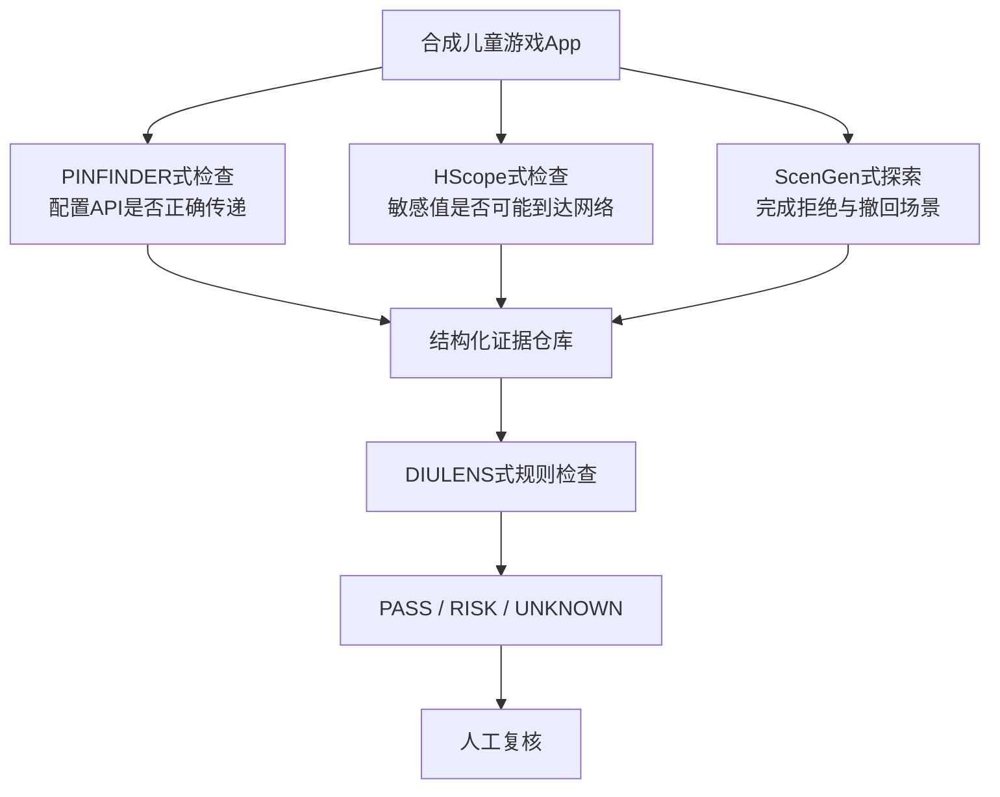

# 四篇论文方法对比

## 先用一句话区分

- **PINFINDER**：SDK 的隐私 API 应该怎样被正确调用？
- **HScope**：敏感值在代码中可能流向哪里？
- **ScenGen**：怎样让智能体可靠完成一个移动界面场景？
- **DIULENS**：怎样把 SDK、界面、路径和时间事件组合成隐私风险判断？

## 精确对比表

| 维度 | DIULENS | PINFINDER | HScope | ScenGen |
|---|---|---|---|---|
| 核心对象 | 移动 CMP 和用户选择 | App/Wrapper 对 SDK 隐私 API 的使用 | OpenHarmony 字节码数据流 | Android GUI 场景 |
| 主要输入 | App、SDK 信息、截图、UI 路径、运行事件 | App 代码/包、SDK 与隐私 API 知识 | HAP/Ark 字节码、Source/Sink 策略 | 场景文本、截图/UI 信息、历史动作 |
| 主要输出 | 四类 DIU 风险及证据 | API 上下文不一致候选 | Source-to-Sink 候选路径 | 完成轨迹、日志、可重放脚本 |
| 静态分析 | 识别 SDK 等基础事实 | 主流程：签名、调用者、参数和调用关系 | 核心：IR、调用图、污点传播 | 不是核心 |
| 动态分析 | UI 探索、运行时访问和时间线 | 静态不足时补充运行值/状态 | 不运行 App | 核心：执行并验证界面状态 |
| LLM/Agent | 理解截图语义、辅助探索与解释 | 不是结论的唯一来源 | 不依赖 LLM | 多智能体负责观察、决策、监督等 |
| 知识库 | SDK/界面语义/规则等辅助知识 | SDK 包名、API 签名、触发条件、正确用法、行为 | Source/Sink 与框架语义模型 | 场景、历史状态、动作和失败记忆 |
| 人工验证 | 复核高风险结论与歧义界面 | 建规则、处理歧义、抽检候选 | 确认路径与风险语义 | 验证 bug、场景和 Ground Truth |
| 不能单独证明 | 法律上最终违法 | 所有运行中都会违规 | 特定运行一定泄露 | SDK 已停止收集数据 |

## 把它们连成一个联合研究原型



这不是把四套完整系统机械拼接，而是迁移四个思想：

1. PINFINDER 的“API 规则化”。
2. HScope 的“可追溯数据流”。
3. ScenGen 的“动作后验证和可重放”。
4. DIULENS 的“多证据规则判定”。

## 最容易混淆的五件事

| 错误说法 | 更准确的说法 |
|---|---|
| 静态分析发现了泄露 | 静态分析发现了可能的 Source-to-Sink 路径 |
| 动态测试没抓到，所以不会泄露 | 仅说明本次环境和路径没有观察到 |
| LLM 判断按钮是拒绝，所以已拒绝 | 还需检查状态变化、Consent Signal 和后续行为 |
| SDK API 被调用，所以已合规 | 还要检查参数、时机、调用者和预期行为 |
| Agent 数量越多越可靠 | 可靠性取决于责任边界、验证条件和可复核证据 |

## 为什么不能全部交给 LLM

LLM 对“隐私”“拒绝”“个性化”等自然语言很敏感，却不天然知道一次点击是否真的改变内部状态，也不能仅凭截图证明某条字节码路径可达。适合的分工是：

```text
LLM：理解语义、提出候选、选择探索方向
确定性分析器：解析代码、执行命令、计算路径
证据仓库：保存截图、调用点、事件和轨迹
规则：把证据变成可重复判定
人工：处理歧义与高影响结论
```


