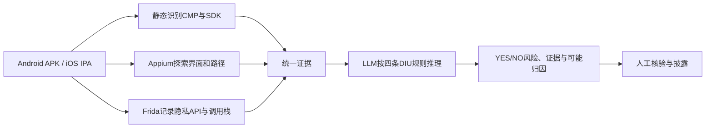

# DIULENS：移动同意管理平台的隐私风险分析

> [!abstract] 一句话结论
> DIULENS 把静态 SDK 识别、Frida 运行时数据访问、Appium GUI 探索和 LLM 多模态推理组合起来，检查移动 App 中 CMP 的显示时机、披露可信度、同意可撤回性与交互效果是否满足四条 DIU 原则。

## 关键图像入口

![[附件/论文截图/DIULENS/image-03.png]]

**系统总览图：** 按“数据集 → CMP/SDK 使用分析 → LLM 辅助 GUI 分析 → 四类 DIU 风险”阅读。它展示模块和证据流，但不能单独证明检测准确率；准确率仍需回到实验与人工 Ground Truth。

## 学习入口

- 论文笔记：本页（泛读、精读与同行评审内容已合并）
- Demo 与代码：[[项目/DIULENS-Mini/00 项目主页]]
- 英文原文：[[附件/论文原文/DIULENS-英文原文-IEEE-SP-2026.pdf]]
- 中文学习译稿：[[附件/论文译文/DIULENS-中文学习译稿.pdf]]
- 扩展学习手册：[[附件/项目资料/参考手册/移动应用供应链隐私合规与LLM程序分析-学习手册.pdf]]

## 研究问题

1. 移动 App 中真实使用了哪些 CMP 和第三方 SDK？
2. 怎样自动找到启动时或设置深处的 CMP 界面，并完整探索内部多层页面？
3. CMP 的界面、SDK 披露和运行时数据访问是否违反有效同意的基本原则？
4. 风险更可能来自 CMP 实现、App 集成配置，还是两者共同作用？

## 四条 DIU 原则

| 规则 | 白话解释 | 主要证据 |
|---|---|---|
| DIU-1 时机 | 在需要同意的数据处理前先显示 CMP | CMP 首次时间与 SDK 数据访问时间线 |
| DIU-2 可信披露 | 界面声称的 SDK/目的应与真实集成和不同页面一致 | 静态 SDK 集合、界面文本、多页面对照 |
| DIU-3 可撤回且不强迫 | 用户能方便重开 CMP、拒绝非必要处理并保存选择 | 入口路径、控件状态、保存/确认效果 |
| DIU-4 交互效果明确 | 按钮文字、视觉和实际产生的同意状态不能误导 | 截图、导航边、点击动作与状态变化 |

## 系统完整工作链路

### 分工边界

- 静态分析回答“代码里集成了谁”，不能证明 SDK 已执行。
- Frida 回答“哪个 SDK 在何时访问了哪类个人数据”，受动态路径覆盖限制。
- Appium 是自动化操作工具，提供 UI 树、截图、控件和点击结果；它本身不是 AI。
- LLM 识别 CMP 语义、给控件排序并综合证据判断，不应替代调用栈、时间戳和人工 Ground Truth。
- 人工研究者构建测试集、解决标注分歧、核查案例并处理负责任披露。

## 数据、评估和关键数字

- 数据集：9,332 个 Android App、3,496 个 iOS App、21 个移动 CMP、1,858 个第三方 SDK 元数据。
- CMP 发现评估：60 个抽样 App、165 个手工识别 CMP 页面；DIULENS 的 App 级覆盖率 92.2%、GUI 级覆盖率 84.8%，该样本中无误报。
- 关键词方法只有 37.9% 精度；FastBot 在相同时间内的 CMP GUI 覆盖率为 28.7%。
- DIU 风险 Ground Truth：两位隐私研究者标注 30 个 Android App，Cohen's Kappa 为 85.4%。
- GPT-4o 版本找到全部 32 个真实风险并产生 2 个误报，精度 94.1%；不同模型实验说明方法不完全绑定单一 LLM。
- 真实测量中发现 656 个显示 CMP 的 App，其中 397 个（60.5%）至少存在一种 DIU 风险；这个比例的分母是“显示 CMP 的 App”，不是全部 12,828 个 App。

> [!warning] 数字使用规则
> 汇报时必须同时说清样本、分母和证据层级。例如“397 个 App 被系统报告存在风险”不等于“397 个 App 已被法院认定违法”。

## 主要案例类型

- CMP 出现前 SDK 已访问设备标识符等个人数据。
- CMP 披露的供应商列表远多于或少于实际集成 SDK。
- 不同 CMP 页面显示不同合作伙伴数量。
- 用户无法重新进入 CMP 撤回同意，或非必要营销 SDK 被标为 Essential。
- “Tap to Play”“继续”等按钮实际表示全部同意，造成交互语义歧义。

## 局限

- Appium 无法覆盖登录、地域限制、反自动化、动态加载和复杂深层路径。
- 包名/框架名识别会受混淆、静态链接和自定义封装影响。
- 隐私 API Hook 只能覆盖知识库已有 API 与测试期间执行到的代码。
- LLM 会误解隐含按钮语义，必须保留截图、路径和事件证据，并允许输出 UNKNOWN。
- 四条 DIU 规则是研究者操作化的隐私原则，不是完整法律条文或最终执法结论。

## 三分钟课堂讲解

1. 移动 App 依赖大量第三方 SDK，CMP 是用户选择向这些 SDK 传播的控制层，但其配置和界面都可能失败。
2. DIULENS 不只看弹窗截图：它把真实 SDK 集成、运行时数据访问时间、CMP 导航路径和多页面内容合并。
3. LLM 主要解决界面语义和多证据推理，Appium/Frida/静态分析提供可验证事实。
4. 系统在 656 个显示 CMP 的 App 中报告 397 个存在至少一类风险，说明“部署 CMP”不等于“得到有效同意”。
5. 最重要的研究启发是把法规价值变成可观测规则，并明确每条结论需要什么证据。

## 最小 Demo

当前 Demo 使用自建 Android App 制造四个合成场景：正常、提前访问、披露不一致、误导交互。Appium 保存截图、XML 和路径；事件记录器保存 CMP 与 SDK 时间线；分析器输出 `YES/NO/UNKNOWN` 和证据。它复现的是论文的**证据链思想**，不是 12,828 个 App 的完整大规模系统。

实现与验证记录统一见 [[项目/DIULENS-Mini/00 项目主页]]。

## 思考题

1. 为什么静态发现某 SDK 不等于它在同意前访问了数据？
2. CMP 首次出现前的任何 SDK 调用都违反 DIU-1 吗？还要区分哪些数据和目的？
3. LLM 判断“按钮误导”时，怎样建立可复查 Ground Truth？
4. 四条规则是否覆盖 consent signal 传入 SDK 后被 Wrapper 丢失的情况？
5. 如果 App 根据国家显示不同 CMP，测试地域如何影响结论？
6. 84.8% GUI 覆盖率能否推导出 84.8% 代码覆盖率？为什么不能？
7. 怎样把 [[04 PICOSCAN供应链隐私误用]] 的隐私 API/Wrapper 检查接入 DIULENS？

## 下一步

阅读 [[04 四条DIU原则]] 与 [[05 DIULENS系统设计]]，不看笔记画出四阶段流程，并给每条 DIU 规则写出“最低必需证据”。

---

## 同行评审与作者回应

# 附录B
### 元评审
以下元审查是由 2026 年 IEEE 安全与隐私研讨会 (S&P) 程序委员会准备的，作为审查流程的一部分，详见征文通知。
### B.1 总结
本文主要受 GDPR 的推动，评估了 Android 和 iOS 移动应用中同意管理平台（CMP） 的隐私法规合规性。它引入了 DIULENS，这是一种通过大语言模型指导方法识别违规行为的工具，该工具将从应用的静态和动态分析中提取的 SDK信息、通过 Appium 的 GUI 元素和屏幕截图作为输入上下文。
### B.2 科学贡献
提供新的数据集供公众使用
创建新工具以实现未来科学
在既定领域向前迈出了宝贵的一步
### B.3 接收理由
1) 本文介绍了一种以大语言模型为指导的方法，用于评估两个流行移动平台（Android 和 iOS）上同意管理平台（CMP）的隐私法规合规性。 DIULENS 主要是自动化的，可以扩展到其他隐私法规和平台。它可以自动触发 CMP、浏览 CMP 图形界面并检测任何不合规情况。 2) 该论文对两个移动平台（9,332 个使用 CMP的 Android 应用和 3,496 个 iOS 应用）进行了大规模评估，发现 371 个 Android 应用和 26 个 iOS 应用至少存在一项违规行为。
### B.4 值得注意的问题
1）小规模手动评估：本文依靠一小部分真实标签来评估他们的工作：（1）第 30 部分中的 30 个 Android 应用。 5.2（无 iOS 应用）用于风险检测，(2) 60 个用于识别 CMP界面 的应用（第 2 节）。 5.1（30 个 Android 应用、30 个 iOS 应用）。尽管 60 个应用覆盖了大约一半的 CMP，但这并不能转化为 Android 和 iOS 上的数千个应用，特别是因为移动应用是异构的，与 Web 生态系统相比，这带来了新的挑战。 2) 大语言模型指导方法的评估。该论文提供了高水平的性能评估，例如使用 CMP界面 识别应用的百分比、风险检测和一些误报解释。然而，它对大语言模型指导方法提供的见解很少，包括提示的每个部分如何单独影响 DIULENS 的性能。随着 CMP 在移动生态系统中变得更加普遍，以及当 DIULENS 扩展到未来的隐私法规和平台时，这应该有助于为未来的工作提供信息。

# 附录C
### 对元评审意见的回应
我们感谢匿名审稿人和牧羊人对我们论文的宝贵反馈和指导。下面，我们对元审查中提出的“值得注意的问题”做出回应。 1) 小规模手动评估：本研究的目的是调查移动应用使用的 CMP中新的隐私风险以及之前未报告的这些风险实例。因此，我们在收集大规模的真实标签进行评估方面本质上受到限制，因此选择使用我们手动确认的一小部分应用来展示这些风险。我们认为，这些应用的评估结果表明了 DIULENS 的有效性，因为 (1) 这些应用是从大量应用中随机抽取的（最大限度地减少人工偏差），(2) 它们覆盖了在 IAB 注册的 21 个移动 CMP中的一半以上 (11)，以及出现在前 10 名 CMP 列表中的所有七个移动 CMP [37]，以及 (3) 样本量与之前的研究相当 [8]、[89]、 [90]这也依赖于手动创建的真实标签。 2）LLM指导方法的评估：我们发现很难正确评估和理解即时组件的影响，部分原因是LLM的不透明性。因此，DIULENS 的评估主要集中于对其检测 DIU风险的整体有效性进行端到端评估。
