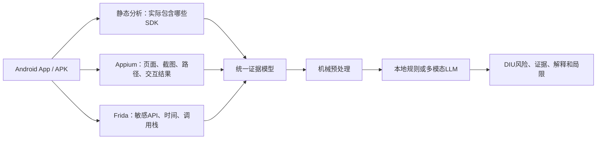
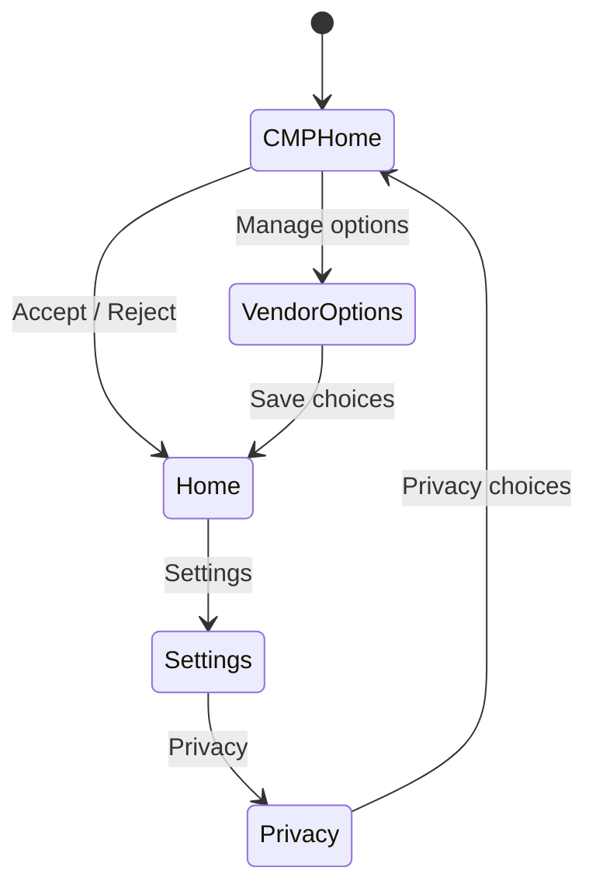

# DIULENS-Mini Demo

> [!info] 导航
> 论文入口：[[论文库/2026-DIULENS-移动CMP隐私风险]]

## 最终要掌握的不是“点按钮”

学完本项目后，你应当能够回答五个问题：

1. CMP管理的是什么，consent signal在系统里如何流动？
2. 四条DIU规则分别需要哪些证据，哪些结论不能只看截图得到？
3. Appium、Frida、静态分析和LLM分别负责什么，为什么不能互相替代？
4. 一条原始事件怎样经过校验、预处理和分析，变成最终风险报告？
5. 当前Demo为什么不是法律违规判定工具，也不是论文完整复现？

## 三条学习路线

### 30分钟：建立全局图

按顺序阅读：

1. 本文的“系统分工”。
2. `01-current-code-walkthrough.md` 的数据流。
3. 运行 `run-demo.cmd`，只观察 early-access 案例。
4. 打开机械证据预处理，找出CMP首次出现时间和提前访问事件。

### 2小时：能运行并能改

1. 跟踪 `cases/02_early_access.json` 到 `AnalysisReport`。
2. 阅读 `models.py`、`rules.py`、`analyzer.py`、`providers.py`。
3. 修改一个SDK名称，运行测试，观察DIU-2的集合差值变化。
4. 构建Android测试App，理解四个场景不是四套代码，而是一个状态机的不同配置。

### 两周：能够独立讲解和调试

1. 自己增加一个合成案例。
2. 自己增加一个Android场景。
3. 从Appium XML中解释一个元素为什么排在另一个元素之前。
4. 运行真实采集，将截图、路径和事件转换成CaseEvidence。
5. 人为制造一次断连或非法XML，并根据错误定位问题。

## 系统分工



- Appium不是AI。它相当于AI或算法控制手机时使用的“手和眼睛”。
- LLM不直接操作Android底层，它读取Appium提供的UI元素，并建议下一步或判断语义。
- Frida不负责找CMP，它负责观察运行时是否调用敏感API，以及调用来自谁。
- 静态分析不能证明SDK运行过，只能说明相应代码被集成进App。
- 风险判断必须保留证据来源；证据不足时应输出UNKNOWN。

## 掌握检查表

- [ ] 能不看资料画出上述流程。
- [ ] 能给每条DIU规则列出所需证据。
- [ ] 能解释静态存在、动态调用和网络发送之间的区别。
- [ ] 能说明离线基线为什么不是真实检测。
- [ ] 能解释LLM误报需要怎样人工复核。

---

## 当前Python代码完整链路

## 1. 一次分析请求发生了什么

以 `early-access` 为例：

```text
用户在app.py选择案例
→ loader.load_cases读取JSON
→ CaseEvidence进行结构和语义校验
→ prepare_evidence计算可确定的事实
→ analyze_case选择在线或离线Provider
→ AnalysisReport再次校验模型输出
→ app.py把证据、规则和局限渲染出来
```

最重要的设计原则是：事实提取和风险解释分开。

- `Adjust在10:00:01访问Android ID` 是原始事件。
- `该事件早于10:00:05首次CMP显示` 是机械事实。
- `因此存在DIU-1风险` 是规则判断。
- `可能仍需确认事件归因和适用法律` 是结论边界。

## 2. models.py：项目的数据合同

### EventType

限制事件只能属于：

- `data_access`：某SDK访问某种数据。
- `cmp_displayed`：某个CMP页面出现。
- `consent_action`：用户进行同意相关操作。

如果所有模块都随意使用字符串，就会出现 `data-access`、`access_data` 等不兼容写法。枚举把这种错误提前变成校验失败。

### EvidenceEvent

它使用 `model_validator` 检查不同事件需要不同字段：

- 数据访问必须有 `sdk` 和 `data_type`。
- CMP显示必须有 `screen`。
- 同意操作必须有 `action`。

这属于“让非法状态无法悄悄进入分析器”。

### CaseEvidence

它是一宗案例的统一证据容器。目前包含截图、实际SDK、披露SDK、运行事件、导航路径、控件能力和离线报告。后续Appium不会改写分析器，而是负责生成同样的数据合同。

### AnalysisReport

最终报告必须恰好包含DIU-1到DIU-4。在线LLM即使返回合法JSON，如果缺少一条规则，也会被Pydantic拒绝并回退。

## 3. loader.py：只负责边界输入

Loader完成三件事：

1. 找到案例JSON。
2. 解析JSON。
3. 交给Pydantic校验。

它不判断风险。这使得以后输入可以来自文件、Appium运行目录或数据库，而规则层保持不变。

## 4. rules.py：机械事实而非最终裁决

`prepare_evidence` 当前计算四组事实：

1. 找到第一次CMP显示时间。
2. 找到此前发生的数据访问。
3. 对实际SDK集合和披露集合做差集。
4. 汇总撤回障碍与标签实际效果不一致。

集合差值的含义：

```text
actual - disclosed = App实际包含但CMP没告诉用户的SDK
disclosed - actual = CMP声称存在但静态证据没发现的SDK
```

为什么不让这里直接决定全部结果？DIU-3和DIU-4常涉及语义。例如“OK”可能实际上保存修改，仅凭关键词会误报。因此机械层提供事实，解释层负责结合上下文。

## 5. providers.py：把分析方法做成可替换策略

`AnalysisProvider` 是共同接口：输入案例和预处理证据，输出报告。

- `OfflineProvider` 返回人工审核过的合成基线，保证课堂无网可运行。
- `OpenAICompatibleProvider` 将结构化证据与截图发送给多模态模型。

在线路径的防护：

1. 密钥来自环境变量，不写进源码。
2. 请求设置超时且不无限重试。
3. 优先要求严格JSON Schema。
4. 再用Pydantic验证语义结构。
5. 任一步失败都由上层回退并显示原因。

离线基线的局限：它是预填答案，不是算法从原始数据重新推导的结论。因此它适合教学与界面演示，不能用于声称真实检测准确率。

## 6. analyzer.py：用例编排器

`analyze_case` 不包含具体规则或API细节，它只组织流程：

```python
prepared = prepare_evidence(case)
if mode == "offline":
    return offline.analyze(...)
try:
    return online.analyze(...)
except AnalysisProviderError:
    return offline.analyze(...)
```

这种编排方式使Streamlit不必知道API如何调用，也使单元测试能够直接测试分析逻辑。

## 7. app.py：展示层

页面负责：选择案例、选择模式、触发分析、保存本次会话结果、渲染截图和规则卡片。页面不应自己计算SDK差集或比较时间，否则相同规则无法被CLI和测试复用。

## 8. 动手实验

### 实验A：制造输入错误

复制一个案例，删除 `data_access` 事件的 `sdk` 字段，再运行：

```powershell
.\.venv\Scripts\python.exe -m pytest -q --basetemp .pytest-tmp
```

观察错误来自模型边界，而不是运行到规则层才崩溃。

### 实验B：理解SDK集合差

在合规案例的 `actual_sdks` 中增加 `ExampleTracker`，但不加入 `disclosed_sdks`。查看机械预处理中的 `missing_disclosures`。

### 实验C：理解回退

不配置密钥，选择在线模式。确认报告标记为离线回退，并显示原因。然后回答：回退结果来自哪里，是否代表模型真的分析了截图？

## 9. 自测题与答案

1. 为什么先校验再分析？——防止缺字段或类型错误被误认为没有风险。
2. `prepare_evidence` 为什么不直接调用LLM？——机械事实可重复、可测试，语义判断才需要模型。
3. Appium数据应接入哪个位置？——生成或适配为 `CaseEvidence`，而不是把设备代码塞进页面。
4. `UNKNOWN` 和 `NO` 有什么区别？——UNKNOWN是证据不足；NO是现有证据支持未发现该风险。
5. 为什么截图不能单独判断DIU-1？——DIU-1需要数据访问与CMP出现的时间关系。

---

## Android CMP实验App原理

## 设计目的

真实第三方App不可控：界面会更新、可能需要登录、可能有反自动化机制，也不应在没有授权时做侵入式测试。因此第一阶段用自建App验证整条方法链。

这个App不是论文目标本身，而是可重复的实验标本。

## 状态机



`dark_pattern` 场景有意删除最后一条返回CMP的边，并把 `Continue` 的真实效果设置为接受全部。

## 三类证据

### UI证据

XML布局为可点击控件提供固定resource-id。Appium读取的页面源会包含文本、ID、可点击状态和坐标。

### 路径证据

Appium记录：当前页面指纹、所点元素、目标页面指纹和截图。多步路径用于验证用户能否重新进入CMP。

### 时间事件

`EvidenceLog` 把事件写入带JSON的Logcat。当前阶段这是受控自报告；Frida阶段将从App外部Hook相同的数据访问API。

## 为什么FakeAnalytics读取Android ID

它具备三个教学优点：

- 是具体的设备标识符访问，不只是打印一行“发生访问”。
- 不需要把数据上传网络。
- 后续可以用Frida Hook `Settings.Secure.getString`，把自报告替换为外部观测。

## 四个场景怎样对应规则

| 场景 | 被改变的事实 | 预期风险 |
|---|---|---|
| compliant | CMP先出现，披露一致，可撤回，标签明确 | 无已知风险 |
| early_access | SDK读取发生在首次CMP显示之前 | DIU-1 |
| sdk_mismatch | FakeAnalytics存在但供应商页不披露 | DIU-2 |
| dark_pattern | 无法重开CMP，Continue实际接受全部 | DIU-3、DIU-4 |

## 学习实验

1. 在 `MainActivity.onCreate` 中找出DIU-1由哪两行的先后顺序形成。
2. 找出 `sdk_mismatch` 只改变披露页面而没有删除FakeAnalytics代码的原因。
3. 给dark pattern恢复隐私选择按钮，预测DIU-3如何变化。
4. 把Continue改回Accept all，预测DIU-4如何变化。

完成后，你应能解释：同一个程序结构可以通过改变时间、披露内容和可达路径，分别构造不同的隐私风险。

---

## Appium采集器代码逻辑

## 1. Appium到底负责什么

Appium不是负责风险判断的AI。它提供四种基础能力：

1. 建立到模拟器的自动化会话。
2. 返回当前页面的XML结构。
3. 返回当前页面截图。
4. 根据resource-id或accessibility id点击元素。

本项目在这些基础能力之上实现CMP定向探索。

```text
Appium Driver
→ page_source / screenshot
→ parse_page_source
→ looks_like_cmp
→ rank_clickable_elements
→ click
→ 保存新页面并重复
```

## 2. ui.py：把平台XML变成算法输入

`UiElement`只保留跨页面分析需要的字段：class、text、resource-id、content-description、bounds、clickable和enabled。

`label` 优先使用无障碍描述，其次使用可见文本，最后使用resource-id尾部。原因是用户和LLM更容易理解语义标签，而resource-id更适合稳定定位。

### 页面指纹

`fingerprint` 对排序后的静态元素做SHA-256，故意排除坐标：

- 同一页面在不同分辨率下不应变成新页面。
- 元素顺序细微变化不应破坏去重。
- 文本或控件集合真正变化时应产生不同指纹。

指纹不是安全哈希用途，而是搜索算法的页面状态ID。

### CMP判断

仅出现“privacy”不能证明这是CMP，也可能是隐私政策。离线判断同时要求：

- 页面存在CMP语义，例如consent、privacy choices、vendors。
- 页面存在可执行选择，例如accept、reject、manage或allow。

这个保守条件对应论文指出的关键词方法误报问题，但仍只是教学近似；完整论文方案由LLM根据CMP指南判断。

### 点击排序

在CMP外部，Privacy choices、Consent、Privacy、Settings依次获得较高分。在CMP内部，accept、reject、save、close等可能结束CMP的操作扣20分，尽量最后点击。

这就是论文“延迟交互策略”的简化实现。

## 3. appium_collector.py：设备适配与流程编排

`AdbClient`负责：

- 安装APK。
- 清空旧日志。
- 强制停止旧进程。
- 通过Intent extra选择场景。
- 提取结构化Logcat证据。

所有命令使用参数列表调用，不拼接Shell字符串，避免空格、中文路径和注入问题。

`collect_with_appium` 的循环：

1. 获取XML。
2. 解析元素。
3. 生成页面指纹。
4. 判断是否为CMP。
5. 保存XML和PNG。
6. 对可点击元素排序。
7. 排除已经在该页面执行过的操作。
8. 点击分数最高的未访问元素。
9. 达到步数或无候选元素后结束。

如果路径已经离开CMP且仍有延迟操作没有探索，采集器最多重启App两次，再继续这些未访问操作。这是record-and-replay的受控简化：重启只服务于覆盖率，绝不能作为“用户可以重新进入CMP”的证据。

`visited_actions` 使用 `(页面指纹, 元素ID)`，因为同一个Settings按钮在不同页面语义不同，不能只按按钮文本全局去重。

CLI只向PowerShell返回纯ASCII的 `run_id`，再由脚本拼接项目路径。这是为了避免Windows旧代码页在捕获含中文的完整路径时把“研讨厅”损坏。

## 4. artifacts.py：为什么每一步都落盘

自动化实验如果只保存最终结论，就无法复查误报。每次运行因此保存：

- `manifest.json`：实验状态、页面和导航索引。
- `step-NNN.png`：人能检查的视觉证据。
- `step-NNN.xml`：算法实际看到的结构证据。
- `events.jsonl`：动态事件，每行独立JSON。
- `case.json`：统一分析输入。
- `report.json`：最终分析输出。

JSONL使日志即使最后一行写入失败，前面事件仍可读取；manifest每一步更新，使中断运行仍能诊断。

## 5. assembler.py：从采集格式到领域模型

Assembler是防腐层：Appium运行文件的格式可以变化，但分析器只认识 `CaseEvidence`。

它完成：

- 将毫秒时间转换成带UTC时区的datetime。
- 从供应商页面识别披露SDK。
- 将点击记录转为NavigationStep。
- 根据CMP重复出现或Privacy choices点击判断能否重新进入。
- 将截图路径转换为项目内相对路径。
- 保证真实案例的 `offline_report=None`，防止预填答案污染实验。

## 6. 第一次真实运行的解释

真实记录 `20260801T200426Z-early_access` 中：

- Appium保存6个页面快照。
- 检测出3个CMP页面状态。
- SDK在设备时间 `...72349` 读取Android ID。
- 首个CMP在 `...72371` 显示。
- 本地规则因此报告DIU-1=`YES`。
- SDK披露集合一致，且能经Settings→Privacy→Privacy choices重新进入CMP。

这条结论来自真实运行时序和UI路径，但数据访问事件目前仍由受控App自报告；加入Frida后才能称为外部动态观测。

## 7. 动手实验

1. 把 `max_steps` 改成2，观察证据为何不足以判断撤回路径。
2. 从 `_NAVIGATION_TERMS` 删除privacy，观察搜索路线变化。
3. 从页面指纹中加入bounds，改变模拟器分辨率并比较指纹。
4. 停止Appium服务后运行collect，检查失败运行的manifest。
5. 查看一次点击的reasons，逐项手算最终分数。

## 8. 自测题

1. 为什么截图和XML都要保留？
2. 为什么不能把所有包含privacy的页面都视为CMP？
3. 延迟点击Accept解决了什么覆盖率问题？
4. 页面指纹为什么不能包含时间戳？
5. Appium成功点击为什么仍不代表用户能够有效撤回同意？

参考答案：截图供人工语义复核，XML供程序定位；隐私政策会造成误报；Accept可能过早退出CMP；时间会让同页永不重复；还需验证保存后的consent signal和SDK实际行为。

---

## 四条DIU规则如何根据证据判断

## 一条结论的三层结构

任何风险卡片都应区分：

1. 原始证据：截图、XML、点击、时间事件、SDK清单。
2. 可重复事实：集合差、时间先后、路径是否可达、标签与效果是否一致。
3. 风险解释：事实是否违反某条DIU规则，以及证据边界。

如果把三层混在一个LLM提示里，错误很难定位。当前实现先由 `prepare_evidence` 计算事实，再由Provider解释。

## DIU-1：CMP显示时机

需要：

- 至少一次CMP显示时间。
- SDK数据访问时间。
- 数据访问归属于哪个SDK。

算法：找到最早 `cmp_displayed`，筛选所有更早的 `data_access`。

- 存在更早访问：YES。
- 有CMP时间且没有更早访问：对已捕获轨迹为NO。
- 没有CMP时间：UNKNOWN。

这里的NO只能说明“本次轨迹没有观察到”，不能证明App所有路径都不会提前访问。

## DIU-2：披露可信度

需要：

- 静态分析得到的实际SDK集合。
- CMP页面披露的SDK集合。

算法：

```text
missing = actual - disclosed
excessive = disclosed - actual
```

任一差集非空即有披露不一致风险。当前实验App的实际集合是受控知识；真实App阶段要用APK静态扫描替代。

## DIU-3：可撤回且不受强迫

需要验证三个独立事实：

- 初始选择之后能从App页面重新进入CMP。
- 能拒绝非必要SDK或用途。
- 修改后能保存。

自动化重启App、重新安装APK或ADB直接启动Activity都不属于用户可达路径，不能作为撤回证据。当前Assembler只认可Appium实际点击 `open_privacy_choices_button` 的路径。

## DIU-4：交互效果明确

需要同时观察：

- 用户看到的标签。
- 点击后的实际同意效果。
- 多页面导航是否保持一致。

例如按钮显示Continue，而事件显示 `continue_actual_effect:accept_all`，构成标签与效果冲突。只看到Continue但没有点击结果时，应为UNKNOWN而不是YES。

## 本地规则与LLM的边界

本地规则适合：时间比较、集合差、明确布尔能力和已编码的效果冲突。它可重复、便于单元测试。

LLM适合：识别高度定制的CMP页面、理解含蓄标签、判断多张截图之间的语义一致性。它更灵活，但需要Schema校验、回退和人工复核。

课堂演示时应说：

> 能机械确定的事实先由程序计算；需要理解界面语义的部分再交给多模态模型。LLM不是数据采集器，也不是法律裁判。

## UNKNOWN为什么重要

常见错误是把“没有看到”当作“没有发生”。以下情况应输出UNKNOWN：

- 没有捕获CMP显示时间，无法判断DIU-1。
- 没有可靠SDK清单，无法判断DIU-2。
- 搜索提前超时，无法判断是否存在撤回路径。
- 没有点击后的状态，无法判断DIU-4。

UNKNOWN保护系统不做超出证据的断言，也是论文复现实验可信度的重要组成部分。

---

## 当前实施状态与下一阶段

更新时间：2026-08-02

## 已完成

- 原有Streamlit合成案例和在线/离线分析。
- 可双击启动的 `run-demo.cmd`。
- 原生Android CMP实验App及四个受控场景。
- Gradle Wrapper和真实APK构建。
- API 34 AVD创建与启动脚本。
- Appium 3、UiAutomator2和Python客户端环境。
- UI XML解析、页面指纹、CMP近似判断和点击排序。
- CMP退出操作延迟探索及有限重启续探。
- 真实截图、XML、路径和Logcat事件落盘。
- 真实运行到CaseEvidence的Assembler。
- 无预填答案的本地DIU规则引擎。
- Streamlit自动加载已分析的真实运行。
- 一键实时采集与演示脚本。
- 四个真实运行场景验证。
- 17项Python自动化测试。

## 已验证结果

| 场景 | DIU-1 | DIU-2 | DIU-3 | DIU-4 |
|---|---|---|---|---|
| compliant | NO | NO | NO | NO |
| early_access | YES | NO | NO | NO |
| sdk_mismatch | NO | YES | NO | NO |
| dark_pattern | NO | NO | YES | YES |

## 下一阶段

1. 在Streamlit中加入直接触发采集和实时进度，而不只通过脚本采集。
2. 将点击搜索从单路径续探升级成完整有界DFS和路径回放。
3. 加入可选LLM页面判断与元素排序，并与本地排序并排解释。
4. 加入Frida外部Hook，替换实验App自报告的数据访问事件。
5. 加入APK包名前缀扫描，为DIU-2生成实际SDK清单。
6. 完成Frida、实验评估和课堂答辩章节。
