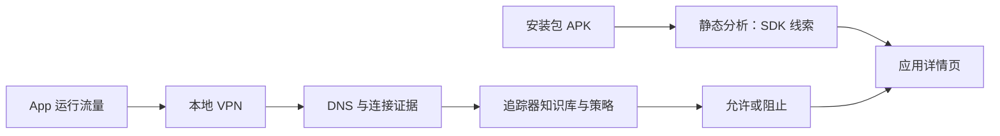

# TrackerControl 源码精读与演示路线

> [!goal] 最终目标
> 能用一个“天气 App 联系统计服务器”的例子，从头解释 TrackerControl 为什么同时需要静态分析和动态分析、每个模块解决了什么新问题、证据如何流转、最终为什么允许或阻止一次连接；并能做一个不依赖真实隐私数据的课堂演示。

## 0. 阅读边界与当前状态

### 这篇笔记适合谁

- 有软件工程基础，能阅读 Java、简单 C 和数据库代码。
- 没学过网络安全、Android VPN、DNS 或程序分析也可以开始。
- 目标不是立刻读懂全部网络协议，而是先建立一条完整、能复述的产品链路。

### 本文唯一贯穿案例

手机里有一个天气 App，包名为 `com.example.weather`，运行时 UID 假设为 `10234`。用户打开天气页面后，App 除了请求天气数据，还尝试连接：

```text
analytics.example.com → 203.0.113.10:443
```

本文用这个合成域名讲解，不把它当成真实追踪器，也不对真实 App 作隐私结论。

### 当前源码依据

本文依据本地目录 `tmp/candidate-repos/tracker-control-android-master/` 中的源码快照和项目 README。这个快照没有 `.git` 元数据，因此**精确 commit、版本号和发布日期仍待核实**；下面的行号只对应当前快照，源码更新后可能漂移。

> [!info] 本文的源码定位约定
> - **项目根目录：** `D:\Projects\研讨厅\tmp\candidate-repos\tracker-control-android-master`
> - 下文的“项目内路径”都从这个根目录开始，例如 `app/src/main/java/...`。
> - 截图由当前本地源码直接渲染，保留实际文件路径和原始行号；蓝色背景表示本阶段最值得先读的代码。
> - 截图是阅读导航，不代替源码。需要查看上下文时，应回到对应文件并向前后继续阅读。

---

## 1. 先用一句话看懂产品

TrackerControl 给 Android 建立一个**本地 VPN 通道**，让其他 App 的网络数据先经过本机的检查程序。它从明文 DNS 记录中学习“某个域名解析到了哪个 IP”，再把后续网络连接归属到具体 App，结合追踪器名单和用户选择的策略决定放行还是阻止。

同时，它还能读取安装包中的类名，判断 App **可能包含哪些追踪 SDK**。

因此它像有两只眼睛：

| 眼睛   | 回答的问题                        | 证据强度        | 不能证明什么              |
| ---- | ---------------------------- | ----------- | ------------------- |
| 静态分析 | 安装包里可能包含哪个追踪 SDK？            | 代码存在性证据     | SDK 是否真的运行、是否真的传了数据 |
| 动态分析 | 运行过程中哪个 App 联系了哪个域名，连接是否被阻止？ | 本次运行的网络行为证据 | 没观察到的路径以后绝不会发生      |



---

追踪器知识库：

**Exodus Privacy** 是一个关注 Android App 隐私的非营利开源项目。你可以把它理解成一个“追踪 SDK 资料库＋App 扫描平台”。

它主要整理两类信息：

- 已知追踪器 SDK 的名称、开发公司和功能
- 这些 SDK 常见的代码特征，例如包名或类名前缀

例如，资料库中可能有一条教学化记录：

```
追踪器名称：Example Analytics
开发公司：Example Inc.
代码特征：com.example.analytics
用途：统计用户行为
```

当某个 App 的 DEX 中出现：

```
com.example.analytics.AnalyticsClient
```

扫描器便可能判断：

> 这个 App 的安装包中包含 Example Analytics SDK。

但这只证明**相关代码可能存在**，不能证明该 SDK 已经运行或上传数据。

TrackerControl 中的 `TrackerSignatureManager` 会从 Exodus Privacy 获取这些追踪 SDK 特征，再放入 `SignatureTrie`，用于快速扫描 App 类名。


Exodus Privacy：提供“追踪 SDK 特征字典”
                       ↓
TrackerControl 静态分析：扫描 APK 中是否出现这些特征
                       ↓
TrackerControl 动态分析：观察 App 实际连接了哪些域名
                       ↓
结合追踪域名名单和用户策略：允许或阻止连接


## 2. 先建立一个最小可运行版本

> [!code] 实现定位：最小扫描核心
> - **项目内路径：** `app/src/main/java/net/kollnig/missioncontrol/analysis/TrackerLibraryAnalyser.java`
> - **关键位置：** `analyseApp()`，第 236–262 行。
> - **这一段完成：** 从包名取得 base/split APK，汇总 tracker 结果并转换为界面可显示的字符串。

![[附件/项目资料/TrackerControl/代码截图/00-最小扫描器-analyseApp.png]]

*截图 00：真正的最小扫描入口；后续三个调度模块最终都会调用这里。*

假设我们从零开发：最开始只做一个扫描器，读取 APK 中的类名，并和一张 SDK 特征表比较。

输入可以简化成：

```text
App 类名：
com.example.weather.MainActivity
com.analytics.sdk.Client

SDK 特征：
com.analytics.sdk → Example Analytics
```

输出：

```text
发现潜在 SDK：Example Analytics
```

这个版本已经能运行，也有价值：即使测试时没有触发广告页，安装包中潜藏的 SDK 仍可能被发现。

但是它马上遇到三个工程问题：

1. Android App 不一定只有一个 APK，还可能有 split APK。
2. 一个 APK 可能有多个 DEX，类数量很大。
3. SDK 特征成千上万时，对每个类逐条遍历特征会很慢。

TrackerControl 的静态分析链路，就是从这个小扫描器逐步解决这些问题。

---

## 3. 静态分析：从按钮到 SDK 结果

### 3.1 用户点击后，为什么不直接在界面线程扫描

**已经完成：** 用户在应用详情页选择一个 App。

**新问题：** 解压 APK、读取 DEX、遍历类名可能持续数秒。如果直接在界面线程执行，页面会卡死；用户退出页面后，任务也容易中断。

**解决方案：** 使用 Android `WorkManager` 把扫描安排成后台任务。

主要分工：

| 模块                       | 白话作用              | 代码入口                                      |
| ------------------------ | ----------------- | ----------------------------------------- |
| `TrackersListAdapter`    | 用户界面的触发点，检查是否已有结果 | `app/src/main/java/net/kollnig/missioncontrol/details/TrackersListAdapter.java:146` |
| `TrackerAnalysisManager` | 任务调度员：建立、去重、读取缓存  | `app/src/main/java/net/kollnig/missioncontrol/analysis/TrackerAnalysisManager.java:37` |
| `TrackerAnalysisWorker`  | 在后台承载一次扫描任务        | `app/src/main/java/net/kollnig/missioncontrol/analysis/TrackerAnalysisWorker.java:50` |

```text
app/src/main/java/
└─ net/kollnig/missioncontrol/
   ├─ details/
   │  └─ TrackersListAdapter.java
   │       用户进入 App 详情页，触发或显示扫描
   │
   └─ analysis/
      ├─ TrackerAnalysisManager.java
      │    创建任务、任务去重、检查缓存
      │
      └─ TrackerAnalysisWorker.java
           在后台真正启动静态分析
```

调用链：

```text
用户打开某 App 的详情
→ TrackersListAdapter 检查缓存
→ TrackerAnalysisManager.startAnalysis(packageName)
→ WorkManager 启动 TrackerAnalysisWorker
→ Worker 调用 TrackerLibraryAnalyser.analyseApp(packageName)
```


解读调用链：
TrackersListAdapter
负责“用户看见什么、点击什么”
        ↓
TrackerAnalysisManager
负责“这个任务要不要运行、怎样排队、缓存在哪里”
        ↓
TrackerAnalysisWorker
负责“在后台执行一次扫描，并汇报进度和结果”
        ↓
TrackerLibraryAnalyser
负责“真正读取 APK/DEX、匹配 SDK”


#### 总目标：扫描一个 App 里有没有追踪 SDK

我们最开始的需求非常简单：

> 用户选择一个天气 App，点击“分析”，程序扫描 APK，显示其中可能包含哪些追踪 SDK。

真正负责扫描的是：

```
TrackerLibraryAnalyser
```

现在暂时把它当成一个已经写好的函数：

```
String result = analyser.analyseApp("com.example.weather");
```

输入是包名，输出可能是：

```
• Example Analytics
• Example Crash Reporter
```

围绕这个最小功能，我们逐步构建完整产品。

#### 阶段一：先做一个能够运行的按钮

> [!code] 实现定位：界面按钮与首次触发
> - **项目内路径：** `app/src/main/java/net/kollnig/missioncontrol/details/TrackersListAdapter.java`
> - **关键位置：** `setupTrackerAnalysisButton()`，第 146–176 行。
> - **这一段完成：** 找到按钮和结果控件，先读缓存；用户点击或满足自动扫描条件时调用 `manager.startAnalysis(mAppId)`。

![[附件/项目资料/TrackerControl/代码截图/01-静态阶段一-界面按钮.png]]

*截图 01：按钮只发布“请分析这个包名”的请求，并不在 UI 线程里解析 APK。*

##### 目前已经完成什么

我们已经有 `TrackerLibraryAnalyser`，它能够：

```
包名
→ 找到 APK
→ 读取 DEX 类名
→ 匹配追踪 SDK 特征
→ 返回结果
```

但普通用户不能直接调用 Java 方法，所以需要一个页面。

##### 新目标

让用户打开天气 App 详情页，点击按钮，看到扫描结果。

##### 最简单的写法

可以直接在按钮点击事件中调用分析器：

```
button.setOnClickListener(v -> {
    TrackerLibraryAnalyser analyser =
            new TrackerLibraryAnalyser(context);

    String result =
            analyser.analyseApp("com.example.weather");

    resultTextView.setText(result);
});
```

这已经是一个能运行的 Demo：

```
用户点击按钮
→ 扫描 APK
→ 显示结果
```

##### 新增模块：TrackersListAdapter

在当前项目中，页面这一层由：

[TrackersListAdapter.java (line 71)](/D:/Projects/研讨厅/tmp/candidate-repos/tracker-control-android-master/app/src/main/java/net/kollnig/missioncontrol/details/TrackersListAdapter.java:71)

负责。

![[附件/项目资料/TrackerControl/代码截图/24-TrackersListAdapter-成员字段与构造参数.png]]

*补充截图 24：Adapter 保存待分析 App 的 UID、包名、Android 上下文和偏好设置引用，同时声明分析按钮、结果文字与进度条等界面成员。红框中的字段是后续把“当前详情页”与“具体待分析 App”联系起来的基础。*

![[附件/项目资料/TrackerControl/代码截图/25-TrackersListAdapter-列表布局与浏览器提示.png]]

*补充截图 25：`onCreateViewHolder()` 根据列表项类型加载普通追踪器行或头部布局；头部还会判断当前 App 是否能处理网页链接，从而对浏览器类 App 显示额外提示。这是 UI 构造与兼容性提示，不是追踪 SDK 检测算法。*

它管理：

- “分析追踪库”按钮
- 扫描进度条
- 扫描结果文字
- 错误提示
- 追踪器类别列表
- 允许或阻止开关

所以最初可以把它理解成：

> `TrackersListAdapter` 是扫描功能的界面入口。

##### 但是出现了新问题

APK 可能很大，扫描几万个甚至十几万个类需要时间。

如果在按钮点击事件中直接扫描：

```
Android 主线程既要刷新页面
又要扫描 APK
→ 页面无法响应
→ 出现卡顿
→ 严重时触发“应用无响应”
```

所以：

```
TrackersListAdapter
不能直接负责真正扫描
```

这推动我们进入下一阶段。
#### 阶段二：把扫描移到后台

> [!code] 实现定位：后台 Worker
> - **项目内路径：** `app/src/main/java/net/kollnig/missioncontrol/analysis/TrackerAnalysisWorker.java`
> - **关键位置：** 类定义和 `doWork()`，第 50–111 行；实际委托扫描见第 84 行。
> - **这一段完成：** 从 WorkManager 输入读取包名，在后台调用分析器，缓存结果并用 `Result.success/failure` 返回状态。

![[附件/项目资料/TrackerControl/代码截图/02-静态阶段二-后台Worker.png]]

*截图 02：Worker 是后台执行容器；真正解析 APK 的仍是 `TrackerLibraryAnalyser`。*

##### 目前已经完成什么

此时系统已经能够：

- 显示天气 App 详情页
- 接收用户点击
- 调用静态分析器
- 显示结果

##### 新目标

扫描 APK 时不能卡住页面，而且用户暂时退出详情页后，任务最好还能继续。

##### 最简单的改进

可以手动创建一个 Thread：

```
new Thread(() -> {
    String result = analyser.analyseApp(packageName);

    activity.runOnUiThread(() -> {
        resultTextView.setText(result);
    });
}).start();
```

这样不会卡住主线程。

##### 但新的问题又出现了

普通 Thread 不理解 Android 页面的生命周期。

例如：

```
用户开始扫描
→ 用户旋转屏幕
→ 原 Activity 被销毁
→ 新 Activity 被创建
→ 老线程还拿着旧 TextView
→ 结果无法安全显示，甚至造成内存泄漏
```

还有：

- App 进程被系统回收怎么办？
- 用户退出页面后怎样查询任务状态？
- 页面重新打开后怎样恢复进度？
- 扫描失败怎样统一返回错误？

##### 解决方案：WorkManager＋Worker

项目引入 Android `WorkManager`，由系统管理后台任务。

真正的后台执行单元是：

[TrackerAnalysisWorker.java (line 50)](/D:/Projects/研讨厅/tmp/candidate-repos/tracker-control-android-master/app/src/main/java/net/kollnig/missioncontrol/analysis/TrackerAnalysisWorker.java:50)

它负责：

```
接收包名
→ 在后台调用 TrackerLibraryAnalyser
→ 返回成功或失败
```

因此程序变成：

```
TrackersListAdapter
只提出“扫描天气 App”的请求
        ↓
WorkManager
管理后台任务
        ↓
TrackerAnalysisWorker
执行扫描
        ↓
TrackerLibraryAnalyser
真正分析 APK
```

到这里，我们已经解决了界面卡顿问题。

##### 但还有一个新问题

如果所有页面都直接操作 WorkManager，会出现大量重复代码：

```
页面 A 自己创建任务
页面 B 自己决定任务名称
页面 C 自己读取缓存
页面 D 自己判断是否重复
```

后台任务虽然有了，但缺少统一的管理入口。

---

#### 阶段三：加入统一的任务调度员

> [!code] 实现定位：统一 Manager
> - **项目内路径：** `app/src/main/java/net/kollnig/missioncontrol/analysis/TrackerAnalysisManager.java`
> - **关键位置：** 单例初始化第 37–67 行；`startAnalysis()` 第 76–104 行。
> - **这一段完成：** 页面只传包名，Manager 统一构造 `Data`、`OneTimeWorkRequest` 和任务名称。

![[附件/项目资料/TrackerControl/代码截图/03-静态阶段三-统一Manager.png]]

*截图 03：Manager 把 UI 发来的业务请求翻译成 WorkManager 能调度的任务。*

##### 目前已经完成什么

系统已经能：

- 从界面启动扫描
- 把扫描放到后台
- 得到成功或失败结果

##### 新目标

需要统一管理：

- 怎样创建任务
- 任务叫什么名字
- 如何防止重复
- 如何查询状态
- 如何保存结果
- 什么时候自动扫描

##### 解决方案：TrackerAnalysisManager

项目加入：

[TrackerAnalysisManager.java (line 37)](/D:/Projects/研讨厅/tmp/candidate-repos/tracker-control-android-master/app/src/main/java/net/kollnig/missioncontrol/analysis/TrackerAnalysisManager.java:37)

它相当于调度员。

现在 Adapter 不需要了解 WorkManager 的具体写法，只需要：

```
manager.startAnalysis(mAppId);
```

也就是告诉调度员：

```
请安排一次对 com.example.weather 的扫描。
```

Manager 再负责构造：

```
OneTimeWorkRequest workRequest =
    new OneTimeWorkRequest.Builder(
        TrackerAnalysisWorker.class)
        .setInputData(inputData)
        .build();
```

此时三个模块的分工第一次真正清晰起来：

```
TrackersListAdapter
负责用户交互

TrackerAnalysisManager
负责安排任务

TrackerAnalysisWorker
负责执行任务
```

---

#### 阶段四：解决用户连续点击的问题

> [!code] 实现定位：UniqueWork 去重
> - **项目内路径：** `app/src/main/java/net/kollnig/missioncontrol/analysis/TrackerAnalysisManager.java`
> - **关键位置：** 第 95–103 行。
> - **这一段完成：** 用 `tracker_analysis_ + packageName` 作为唯一名称，并使用 `ExistingWorkPolicy.KEEP` 保留已经排队或运行的同包名任务。

![[附件/项目资料/TrackerControl/代码截图/04-静态阶段四-UniqueWork去重.png]]

*截图 04：这一层防的是“同一个 App 被连续点击多次”。*

##### 目前已经完成什么

点击一次按钮，后台能够完成一次扫描。

##### 新目标

用户连续点击五次按钮时，不能同时扫描天气 App 五次。

否则会：

- 重复读取同一个 APK
- 重复占用内存
- 浪费 CPU 和电量
- 得到五份相同结果

##### 原来的方案为什么不够

如果每次点击都直接创建一个 `OneTimeWorkRequest`：

```
点击 1 → Worker 1
点击 2 → Worker 2
点击 3 → Worker 3
```

WorkManager 会认为它们是三个独立任务。

##### 解决方案：给每个 App 一个唯一任务名

Manager 根据包名生成：

```
tracker_analysis_com.example.weather
```

然后使用：

```
workManager.enqueueUniqueWork(
    getWorkName(packageName),
    ExistingWorkPolicy.KEEP,
    workRequest);
```

`KEEP` 的意思是：

> 如果同名任务已经排队或运行，就保留原任务，忽略新请求。

因此：

```
天气 App 第一次点击
→ 创建任务

天气 App 第二次点击
→ 发现任务已经存在
→ 不重复创建
```

##### 但是还剩下一个问题

唯一任务只能阻止“同一个 App 重复扫描”，不能阻止：

```
天气 App 正在扫描
游戏 App 也开始扫描
视频 App 也开始扫描
```

它们的任务名不同，所以 WorkManager 仍可能同时运行。

---

#### 阶段五：限制不同 App 同时扫描

> [!code] 实现定位：Semaphore 限制重型扫描并发
> - **项目内路径：** `app/src/main/java/net/kollnig/missioncontrol/analysis/TrackerAnalysisWorker.java`
> - **关键位置：** 信号量定义第 52 行；获取和释放第 75–111 行。
> - **这一段完成：** 不同包名虽然拥有不同 UniqueWork，真正进入 APK/DEX 分析前仍必须竞争同一张许可证。

![[附件/项目资料/TrackerControl/代码截图/05-静态阶段五-Semaphore限流.png]]

*截图 05：`finally` 中归还许可证，保证异常不会永久堵住后续扫描。*

##### 目前已经完成什么

系统已经保证同一个包名不会产生重复任务。

##### 新目标

手机内存有限，不能同时展开多个大型 APK 和多个 DEX。

##### 解决方案：Worker 中加入 Semaphore

Worker 中定义：

```
private static final Semaphore ANALYSIS_SEMAPHORE =
        new Semaphore(1);
```

可以把它理解成扫描室只有一把钥匙。

运行前：

```
ANALYSIS_SEMAPHORE.acquire();
```

完成后：

```
ANALYSIS_SEMAPHORE.release();
```

场景如下：

```
天气 App Worker 拿到钥匙
→ 开始扫描

游戏 App Worker 到达
→ 没有钥匙，只能等待

天气 App 扫描完成并归还钥匙
→ 游戏 App 才开始
```

所以目前有两层保护：

```
Manager 的 UniqueWork
→ 防止同一个 App 重复排队

Worker 的 Semaphore(1)
→ 防止不同 App 同时执行重型分析
```

##### 为什么 release 必须放在 finally 中

如果扫描中途异常：

```
finally {
    if (acquired)
        ANALYSIS_SEMAPHORE.release();
}
```

仍然要归还钥匙。

否则一次扫描崩溃后，钥匙永久丢失，后面的所有扫描都会永远等待。

---

#### 阶段六：解决反复扫描造成的浪费

> [!code] 实现定位：结果缓存与版本失效
> - **项目内路径：** `app/src/main/java/net/kollnig/missioncontrol/analysis/TrackerAnalysisManager.java`
> - **关键位置：** `getCachedResult()`、`isCacheStale()`、`cacheResult()`，第 113–142 行。
> - **写入调用：** `TrackerAnalysisWorker.java` 第 86–88 行。
> - **这一段完成：** 结果和 App `versionCode` 一起进入 `SharedPreferences`，App 版本升高时判定旧缓存过期。

![[附件/项目资料/TrackerControl/代码截图/06-静态阶段六-结果缓存.png]]

*截图 06：当前缓存只绑定 App 版本，尚未绑定 Exodus 特征库版本。*

##### 目前已经完成什么

系统现在能：

- 后台扫描
- 防止重复任务
- 控制扫描并发
- 返回扫描结果

##### 新目标

用户每次打开天气 App 详情页时，不应该重新扫描同一个版本。

因为同一版本 APK 的代码没有变化，重复扫描只是浪费资源。

##### 解决方案：缓存扫描结果

Worker 成功后调用：

```
manager.cacheResult(
    packageName,
    result,
    pkg.versionCode);
```

缓存内容类似：

```
trackers_com.example.weather
→ “• Example Analytics”

versioncode_com.example.weather
→ 12
```

用户再次打开页面时，Adapter 先调用：

```
String cachedResults =
        manager.getCachedResult(mAppId);
```

如果已有结果，直接显示：

```
打开页面
→ 读取缓存
→ 立即显示
```

不需要再次扫描 APK。

##### 但 App 升级后怎么办

天气 App 从版本 12 更新到版本 13，里面可能：

- 新增 SDK
- 删除 SDK
- 更换 SDK
- 改变包结构

所以 Manager 比较：

```
当前 versionCode
和
缓存保存的 versionCode
```

如果：

```
当前版本 13 > 缓存版本 12
```

就判定缓存过期。

Adapter 仍可以显示旧结果，但会提示：

```
这个结果来自旧版本，请重新分析。
```

##### 当前仍有一个局限

它只比较 App 版本，没有比较 Exodus 特征库版本。

可能出现：

```
天气 App 版本没变
Exodus 新增了一个追踪 SDK 特征
旧扫描结果仍然被认为有效
```

后续可以改成：

```
缓存有效性 =
App版本一致
并且特征库版本一致
并且分析器版本一致
```

---

#### 阶段七：避免失败任务无限自动重试

> [!code] 实现定位：当前版本的自动尝试控制
> - **项目内路径：** `app/src/main/java/net/kollnig/missioncontrol/analysis/TrackerAnalysisManager.java`
> - **关键位置：** `shouldStartAnalysis()` 第 129–165 行；`markAnalysisAttempted()` 与 `hasAttemptedCurrentVersion()` 第 171–190 行。
> - **这一段完成：** 自动扫描每个版本最多尝试一次；用户手动点击仍可重新发布任务。

![[附件/项目资料/TrackerControl/代码截图/07-静态阶段七-自动重试控制.png]]

*截图 07：这里记录的是“已经尝试”，不是“已经成功”。*

###### 目前已经完成什么

如果没有缓存或缓存过期，页面可以自动开始扫描。

##### 新目标

用户第一次进入详情页时，最好不用主动点击按钮。

所以 Adapter 中有：

```
if (manager.shouldStartAnalysis(mAppId))
    manager.startAnalysis(mAppId);
```

##### 新问题

假设某个系统 App 无法读取，扫描每次都失败。

如果只判断“没有缓存”：

```
第一次进入页面 → 自动扫描失败
第二次进入页面 → 因为没有缓存，再次扫描失败
第三次进入页面 → 再次扫描失败
```

用户每次打开页面都会浪费资源。

##### 解决方案：记录“当前版本已经尝试过”

Manager 保存：

```
attempted_versioncode_com.example.weather
→ 12
```

自动扫描条件变成：

```
return !attemptedCurrentVersion
    && (cachedResult == null || cacheStale);
```

翻译成人话：

```
当前版本还没尝试过
并且
没有缓存或者缓存过期
→ 自动扫描
```

已经尝试过就不再自动启动。

##### 为什么手动按钮仍然能运行

用户点击按钮时直接调用：

```
manager.startAnalysis(mAppId);
```

不会经过 `shouldStartAnalysis()`。

所以：

```
自动重试受到限制
手动重试仍然允许
```

这是“避免资源浪费”和“允许用户恢复”之间的平衡。

##### 当前还存在一个小问题

`markAnalysisAttempted()` 在任务真正完成之前就执行。

如果任务刚排队就被取消，也会被记为“已尝试”。这可以作为后续评价或改进点。

---

#### 阶段八：扫描时间较长，需要告诉用户进度

> [!code] 实现定位：进度从分析器回到界面
> - **产生进度：** `app/src/main/java/net/kollnig/missioncontrol/analysis/TrackerAnalysisWorker.java:114–126`。
> - **观察任务：** `app/src/main/java/net/kollnig/missioncontrol/details/TrackersFragment.java:100–123`。
> - **显示进度：** `app/src/main/java/net/kollnig/missioncontrol/details/TrackersListAdapter.java:202–214`。
> - **这一段完成：** `current/total → percent → WorkInfo → Fragment → Adapter`，Worker 不直接持有页面控件。

![[附件/项目资料/TrackerControl/代码截图/08-静态阶段八-进度回传.png]]

*截图 08：三层传递保证页面重建后仍能重新观察后台任务。*

##### 目前已经完成什么

扫描可以在后台正常完成。

##### 新目标

用户点击以后不能只看到一个没有反应的页面，否则会怀疑程序卡死。

##### 原来的方案为什么不够

Worker 最初可能只有：

```
开始
→ 扫描几秒
→ 最后返回结果
```

中间没有信息。

##### 解决方案：Worker 报告进度

`TrackerLibraryAnalyser` 每处理一部分类，就回调：

```
(current, total)
```

例如：

```
当前完成：7000 个类
总共：20000 个类
```

Worker 转换成百分比：

```
int percent =
    (int) ((current / (float) total) * 100);
```

得到：

```
35%
```

然后调用：

```
setProgressAsync(...)
```

把进度交给 WorkManager。

############ 页面如何收到进度

不是 Worker 直接操作进度条，而是：

```
Worker 更新 WorkManager 状态
        ↓
LiveData 通知 TrackersFragment
        ↓
TrackersFragment 调用
adapter.updateAnalysisState(workInfo)
        ↓
Adapter 更新进度条
```

对应桥接代码：

[TrackersFragment.java (line 100)](/D:/Projects/研讨厅/tmp/candidate-repos/tracker-control-android-master/app/src/main/java/net/kollnig/missioncontrol/details/TrackersFragment.java:100)

这样页面即使重新创建，也能重新观察当前任务。

---

#### 阶段九：不仅要显示进度，还要处理完整状态

> [!code] 实现定位：WorkInfo 状态机
> - **项目内路径：** `app/src/main/java/net/kollnig/missioncontrol/details/TrackersListAdapter.java`
> - **关键位置：** `updateAnalysisState()`，第 181–246 行。
> - **这一段完成：** 把 `ENQUEUED/BLOCKED/RUNNING/SUCCEEDED/FAILED/CANCELLED` 映射为按钮、进度条、结果和错误的不同界面状态。

![[附件/项目资料/TrackerControl/代码截图/09-静态阶段九-任务状态机.png]]

*截图 09：这段是 UI 状态机，不是 SDK 检测算法。*

##### 目前已经完成什么

Worker 可以报告运行百分比。

##### 新目标

页面必须正确处理任务的完整生命周期。

因此 Adapter 增加状态机：

[updateAnalysisState() (line 181)](/D:/Projects/研讨厅/tmp/candidate-repos/tracker-control-android-master/app/src/main/java/net/kollnig/missioncontrol/details/TrackersListAdapter.java:181)

不同状态对应不同界面：

```
ENQUEUED
→ 显示“等待分析”
→ 禁用按钮

RUNNING
→ 显示进度条
→ 隐藏旧扫描结果

SUCCEEDED
→ 隐藏进度条
→ 显示新结果
→ 恢复按钮

FAILED
→ 隐藏进度条
→ 显示错误原因
→ 允许用户重试

CANCELLED
→ 恢复初始界面
```

到这里，它才从“一个能扫描的按钮”变成了“一个用户可以理解和控制的完整功能”。

---

#### 阶段十：支持新安装 App 的自动通知

> [!code] 实现定位：可选安装通知
> - **任务输入：** `app/src/main/java/net/kollnig/missioncontrol/analysis/TrackerAnalysisManager.java:84–93`。
> - **通知实现：** `app/src/main/java/net/kollnig/missioncontrol/analysis/TrackerAnalysisWorker.java:128–176`。
> - **这一段完成：** 有真实 `notificationUid` 时生成通知；详情页手动扫描传入 `-1`，因此不会通知。

![[附件/项目资料/TrackerControl/代码截图/10-静态阶段十-安装通知.png]]

*截图 10：同一个 Worker 同时服务“详情页扫描”和“新安装提示”两种入口。*

##### 目前已经完成什么

用户打开详情页后，可以看到扫描结果。

##### 新目标

如果 TrackerControl 在后台发现用户刚安装了一个新 App，希望不用用户打开页面，也能提示：

```
新安装的 App 中发现 3 个追踪 SDK
```

##### 解决方案：增加第二种任务输入

Manager 提供两个入口：

```
startAnalysis(packageName)
```

用于详情页手动扫描。

以及：

```
startAnalysis(packageName, notificationUid, appName)
```

用于安装事件触发的扫描。

Worker 扫描完成后检查：

```
int uid = getInputData()
        .getInt(KEY_NOTIFICATION_UID, -1);

if (uid < 0)
    return;
```

如果 UID 是 `-1`，说明来自普通页面，不发通知。

如果带有真实 UID 和 App 名称，就构建安装通知。

于是同一个 Worker 可以复用在两种场景：

```
用户主动查看
→ 结果显示在详情页

App 新安装
→ 结果显示在系统通知
```

---

#### 阶段十一：SDK 特征库会过期

> [!code] 实现定位：Exodus 特征下载与回退
> - **更新触发：** `app/src/main/java/net/kollnig/missioncontrol/analysis/TrackerAnalysisManager.java:46–59`。
> - **下载与校验：** `app/src/main/java/net/kollnig/missioncontrol/analysis/TrackerSignatureManager.java:47–84`。
> - **缓存优先、内置资源回退：** `TrackerSignatureManager.java:96–107`。
> - **这一段完成：** 超过 24 小时后尝试联网更新；缓存不可用时仍可使用 APK 内置特征运行。

![[附件/项目资料/TrackerControl/代码截图/11-静态阶段十一-特征更新.png]]

*截图 11：当前 `last_signature_update` 更接近“上次尝试时间”，且新特征不会自动让旧 App 扫描缓存失效。*

##### 目前已经完成什么

系统能用 Exodus Privacy 的 SDK 特征匹配 APK 类名。

##### 新目标

新的追踪 SDK 会不断出现，旧 SDK 的特征也可能发生变化，所以不能永远使用打包时的特征表。

##### 解决方案：Manager 定期更新特征

Manager 首次创建时检查：

```
距离上次更新是否超过 24 小时
```

如果超过，就在后台调用：

```
new TrackerSignatureManager(mContext)
        .updateSignatures();
```

从 Exodus Privacy 下载新的特征表，保存为本地 `trackers.json`。

读取时：

```
优先使用下载的缓存
→ 缓存不存在或损坏
→ 使用 APK 内置特征
```

这样即使网络失败，静态分析仍然能够运行。

##### 目前的两个局限

第一，代码记录的是“上次尝试更新时间”，不一定是“上次成功更新时间”。

第二，新特征下载完成后，没有让旧 App 扫描缓存自动过期。

这是很适合作为项目改进的地方：

```
为特征库增加版本号
→ App 扫描结果记录特征库版本
→ 特征库升级后自动判定缓存过期
```

---

##### 最终形成的完整产品链路

经过这些阶段，现在的结构是：

```
用户打开天气 App 详情页
        ↓
TrackersListAdapter
读取缓存、展示按钮和状态
        ↓
没有有效缓存，或用户点击重新分析
        ↓
TrackerAnalysisManager
记录尝试版本、构造唯一后台任务
        ↓
WorkManager
保存并调度任务
        ↓
TrackerAnalysisWorker
等待 Semaphore，控制一次只扫描一个 App
        ↓
TrackerLibraryAnalyser
读取 base APK、split APK 和 DEX
        ↓
SignatureTrie
匹配 Exodus SDK 特征
        ↓
Worker
报告进度、缓存结果、返回成功或错误
        ↓
WorkManager LiveData
通知 TrackersFragment
        ↓
TrackersListAdapter
显示进度、结果或错误
```

---

# 总结：三个模块最终各自解决什么

| 模块                       | 出现前的问题                 | 主要解决方案             |
| ------------------------ | ---------------------- | ------------------ |
| `TrackersListAdapter`    | 用户无法触发扫描、看不到状态         | 提供按钮、进度、结果和错误界面    |
| `TrackerAnalysisManager` | 页面各自调度、任务重复、结果反复扫描     | 统一创建唯一任务、判断缓存和自动扫描 |
| `TrackerAnalysisWorker`  | 扫描阻塞界面、不同 App 同时扫描消耗过大 | 后台执行、信号量限流、报告进度和结果 |

### 3.2 为什么需要缓存和任务去重

**已经完成：** 后台扫描不再卡住界面。

**新问题：** 用户反复进入详情页时，重复扫描同一个版本会浪费 CPU 和电量；同一 App 也不应同时启动两份扫描。

**解决方案：**

- 以包名组织唯一后台任务。
- 缓存扫描结果。
- 用 App 版本变化判断缓存是否过期，入口见 `TrackerAnalysisManager.java:118`。
- Worker 内用 `Semaphore(1)` 限制同时进行的分析数量。（Worker 是执行特定任务的工作单元，Semaphore(1) 是初始许可数为 1 的信号量，限制同时执行的协程或线程数为 1，在 Worker 内使用可确保同一时间只有一个分析任务进行。）

**仍有局限：** 当前缓存主要跟随 App 版本。若 SDK 特征库更新而 App 版本不变，旧结果是否自动失效需要进一步验证和改进。一个更严谨的缓存键应至少包含：

```text
packageName + appVersion + signatureDatabaseVersion + analyserVersion
```

### 3.3 为什么必须处理 base APK、split APK 和多个 DEX

第一次出现的术语：

- **APK（Android Package）**：Android 安装包，可以理解为装着代码和资源的压缩包。
- **split APK（拆分安装包）**：系统可能把语言、CPU 架构、功能模块分开放，不一定所有代码都在主 APK。
- **DEX（Dalvik Executable）**：Android 实际保存 Java/Kotlin 编译后类的格式，常见文件为 `classes.dex`、`classes2.dex`。

**已经完成：** 可以扫描一个简单 APK。

**新问题：** 只读主 APK 的 `classes.dex` 会漏掉拆分包或第二个 DEX 中的 SDK。

**解决方案：** `TrackerLibraryAnalyser.analyseApp()` 收集主 APK 和拆分 APK；`findTrackers()` 找出其中的 DEX；`processSingleDex()` 使用 dexlib2 读取类名。

代码入口：

- `analysis/TrackerLibraryAnalyser.java:118`：处理一个 DEX。
- `analysis/TrackerLibraryAnalyser.java:159`：查找和组织 DEX 扫描。
- `analysis/TrackerLibraryAnalyser.java:236`：分析整个 App。

为了兼顾速度和内存，多个 DEX 可以并发处理，但当前实现把并发数控制为 2。这里的设计目标不是“线程越多越快”，而是防止大 APK 同时展开过多对象导致内存压力。

### 3.4 “SDK 签名”在这里是什么意思

这里的 **signature（签名/特征）** 不是开发者给 APK 做的密码学签名，也不是 PICOSCAN 中“方法名＋参数类型”的隐私 API 签名。

这里指的是：**某个追踪 SDK 常用的包名或类名前缀**。

例如教学用特征：

```text
特征：com.analytics.sdk
类名：com.analytics.sdk.Client
结论：类名命中了 Example Analytics 的代码特征
```

`TrackerSignatureManager` 从 Exodus Privacy 接口获取追踪器条目，入口为：

- `analysis/TrackerSignatureManager.java:30`：接口地址。
- `analysis/TrackerSignatureManager.java:101`：读取特征列表。

命中只说明“代码中出现了相符类名”，不说明 SDK 已初始化或已发送隐私数据。

---

## 4. SignatureTrie：为什么需要前缀树

### 4.1 提出问题之前，我们已经完成了什么

此时系统已经能够：

1. 取得 App 的 APK 和 split APK。
2. 找到所有 DEX。
3. 逐个读出类名。
4. 取得 SDK 代码特征。

最简单的匹配方法是双重循环：每读到一个类名，就遍历所有 SDK 特征。

```text
for 每个类名:
    for 每个 SDK 特征:
        判断类名是否匹配特征
```

假设有 100,000 个类名、5,000 条特征，最坏需要约 5 亿次比较。大量字符串还会反复比较相同前缀，例如 `com`、`google`、`analytics`。

### 4.2 新目标导致的新模块

> [!code] 实现定位：SignatureTrie
> - **树结构与匹配：** `app/src/main/java/net/kollnig/missioncontrol/analysis/SignatureTrie.java:32–79`。
> - **把 Exodus 特征装入树：** `app/src/main/java/net/kollnig/missioncontrol/analysis/TrackerLibraryAnalyser.java:85–101`。
> - **这一段完成：** `insert()` 建树，`findMatch()` 沿类名字符前进并保留最后一个完整特征命中。

![[附件/项目资料/TrackerControl/代码截图/12-SignatureTrie-前缀匹配.png]]

*截图 12：Trie 只解决大量类名特征的查找效率，不判断 SDK 是否在运行。*

**新目标：** 在手机上也要尽量快、少耗电地完成大规模前缀匹配。

**解决方案：** 使用 `SignatureTrie`，即存放 SDK 特征的前缀树。

第一次出现的术语：

- **Trie（前缀树）**：把多个字符串的公共开头只保存一次的数据结构。
- **节点**：树中的一个字符位置。
- **最长前缀匹配**：沿类名向下走，记录走过途中最后一个完整特征。

示意：

```text
com.analytics.sdk
com.analytics.ads

共同部分只走一次：
com.analytics.
              ├─ sdk
              └─ ads
```

对应代码：

- `analysis/SignatureTrie.java:32`：前缀树类型。
- `analysis/SignatureTrie.java:44`：插入 SDK 特征。
- `analysis/SignatureTrie.java:61`：用类名寻找命中项。
- `analysis/TrackerLibraryAnalyser.java:85`：把特征表构造成 Trie。

### 4.3 用天气 App 手工走一遍

特征库中插入：

```text
com.analytics.sdk → Example Analytics
```

扫描到类名：

```text
com.analytics.sdk.Client
```

程序沿字符向下查找：

```text
c → o → m → . → a → ... → s → d → k
```

走到 `com.analytics.sdk` 时发现这是一个完整特征，于是记录命中。即使后面还有 `.Client`，仍返回已经找到的 SDK。

### 4.4 Trie 解决了什么，没有解决什么

它解决的是**查找效率**，不是识别语义，也不是隐私判定。

仍可能出现：

- **误报**：简单字符串包含关系命中，但代码并非真正 SDK。
- **漏报**：SDK 被混淆、改包名、动态下载或反射加载。
- **证据不足**：命中类名不能证明运行时发送数据。

所以产品下一步必须增加动态分析，而不是继续把 Trie 变得更复杂就能解决全部问题。

---

## 5. 为什么静态分析之后还必须做动态分析

静态扫描可能报告天气 App 含有 `Example Analytics`，但有三种完全不同的真实情况：

1. SDK 从未初始化，只是残留依赖。
2. SDK 仅在用户打开某页面后运行。
3. SDK 一启动就联系服务器。

仅看类名无法区分。新目标变成：

> 当 App 真正运行时，观察它联系谁，并在不读取 HTTPS 正文的前提下决定是否阻止。

下面继续采用“先能跑，再不断补模块”的方式理解动态链路。

---

## 6. 动态分析阶段一：先让流量经过我们

> [!code] 实现定位：本地 VPN 与 TUN 入口
> - **项目内路径：** `app/src/main/java/eu/faircode/netguard/ServiceSinkhole.java`。
> - **VpnService 类型：** 第 128 行；内部启动流程第 586–611 行；VPN Builder 第 1553–1572 行。
> - **这一段完成：** 配置本地虚拟网卡和路由，把其他 App 的流量送入 TrackerControl 的处理链。

![[附件/项目资料/TrackerControl/代码截图/13-动态阶段一-本地VPN.png]]

*截图 13：这是 TrackerControl 自己的 VPN 服务，不是在目标 App 上挂按钮或注入代码。*

### 6.1 已经有什么，缺什么

**已有：** Android 系统正常把天气 App 的网络数据发往互联网。

**缺少：** TrackerControl 看不到其他 App 的网络连接。普通 App 也没有权限直接偷看另一个 App 的内存或 HTTPS 正文。

### 6.2 最小解决方案：本地 VPN

第一次出现的术语：

- **VPN（Virtual Private Network，虚拟专用网络）**：这里不是先理解成“翻墙服务器”，而是 Android 提供给 App 的网络接管接口。
- **VpnService**：Android 允许一个 App 创建 VPN 的系统组件。
- **TUN**：系统提供的虚拟网卡文件；App 从中读取网络包，再决定如何处理。

`ServiceSinkhole` 继承 Android `VpnService`：

- `eu/faircode/netguard/ServiceSinkhole.java:128`：服务类。
- `ServiceSinkhole.java:586`：内部启动流程。
- `ServiceSinkhole.java:1553`：配置 VPN Builder。

天气 App 的数据路径变成：

```text
天气 App
→ Android 网络栈
→ TrackerControl 的本地 TUN
→ TrackerControl 检查
→ 放行到互联网，或在本机阻止
```

默认情况下，数据不需要先传到 TrackerControl 自己的外部服务器。远程 WireGuard 出口是可选功能，不是本地检查的必要条件。

### 6.3 这一阶段仍然不够

现在程序能收到网络包，但每秒可能有大量包。若所有解析都用 Java 对象处理，会产生性能、垃圾回收和 TCP 状态管理压力。因此需要把高频、底层部分交给更适合的模块。

---

## 7. 动态分析阶段二：为什么加入本地 C 引擎

> [!code] 实现定位：Java → JNI → Native C
> - **项目内路径：** `app/src/main/java/eu/faircode/netguard/ServiceSinkhole.java`。
> - **关键位置：** `startNative()` 第 1831–1900 行；第 1894 行调用 `jni_run(..., vpn.getFd(), ...)`。
> - **Native 源码目录：** `app/src/main/jni/netguard/`，其中包含 `ip.c`、`tcp.c`、`udp.c`、`dns.c` 等。
> - **这一段完成：** 把 TUN 文件描述符交给长期运行的本地网络引擎；Java 保留 Android API、策略和 UI 职责。

![[附件/项目资料/TrackerControl/代码截图/14-动态阶段二-Native引擎.png]]

*截图 14：`jni_run` 是 Java 和 Native 数据包循环之间的关键交界点。*

### 7.1 新目标

在手机有限的 CPU、电池和内存下，持续处理大量 IP、TCP、UDP 和 DNS 数据。

### 7.2 分工方案

- **C 引擎**：处理高频网络包、连接状态和 DNS 解析。
- **Java 层**：利用 Android API 查 App 身份，读取用户设置、查询数据库、呈现 UI。

`ServiceSinkhole.startNative()` 在 `ServiceSinkhole.java:1831` 把 TUN 文件描述符等配置交给 JNI/native 引擎。

第一次出现的术语：

- **JNI（Java Native Interface）**：Java 与 C/C++ 相互调用的桥梁。
- **文件描述符**：操作系统给已打开资源的编号；这里可把它理解为 TUN 的“句柄”。
- **会话状态**：TCP 等连接当前进行到哪一步的记录。

白话分工：C 是高速分拣员，Java 是能查系统户籍和执行产品政策的管理员。

### 7.3 为什么不能全部放在 C 里

C 擅长处理字节和连接，但不方便直接完成 Android 包名查询、偏好设置、Activity UI 和 SQLite 业务组织。分层不是因为某种语言“绝对更快”，而是把职责放在更适合且更容易维护的位置。

---

## 8. 动态分析阶段三：网络包是谁发的

> [!code] 实现定位：连接归属 UID
> - **项目内路径：** `app/src/main/java/eu/faircode/netguard/ServiceSinkhole.java`。
> - **关键位置：** `getUidQ()`，第 2290–2313 行。
> - **这一段完成：** 用连接的地址、端口和协议调用 Android `getConnectionOwnerUid()`，把网络连接映射到 UID。

![[附件/项目资料/TrackerControl/代码截图/15-动态阶段三-UID归属.png]]

*截图 15：数据包本身没有包名；UID 是网络证据和具体 App 之间的桥梁。*

### 8.1 新问题

一个网络包通常带有源/目的 IP、端口和协议，却不会直接写着 `com.example.weather`。

如果不知道来源 App，系统只能说“手机联系了这个地址”，不能提供按 App 的隐私报告，也不能执行每个 App 的不同规则。

### 8.2 解决方案：连接五元组 → UID → 包名

第一次出现的术语：

- **五元组**：源 IP、源端口、目的 IP、目的端口、协议，用来描述一条网络连接。
- **UID（User Identifier）**：Android 给应用进程分配的数字身份。
- **包名**：App 的稳定程序名，例如 `com.example.weather`。

`ServiceSinkhole.getUidQ()` 位于 `ServiceSinkhole.java:2290`，借助 Android `ConnectivityManager.getConnectionOwnerUid()` 把连接映射到 UID，再由系统包管理信息关联到 App。

我们的案例变成：

```text
连接：本机临时端口 → 203.0.113.10:443/TCP
Android 查询结果：UID 10234
包管理结果：com.example.weather
```

### 8.3 剩余局限

- 某些系统流量可能无法可靠归属。
- 多个包可能共享 UID。
- 工作资料、厂商系统和 Android 版本差异可能影响结果。

因此 UID 归属是重要证据，但不应被宣传成任何设备上都百分之百准确。

---

## 9. 动态分析阶段四：为什么 IP 还不够

> [!code] 实现定位：DNS 解析、JNI 回调与落库
> - **Native DNS 解析：** `app/src/main/jni/netguard/dns.c:78–130`，入口 `parse_dns_response()`。
> - **回到 Java：** `app/src/main/java/eu/faircode/netguard/ServiceSinkhole.java:2260–2272`，方法 `dnsResolved()`。
> - **写入 SQLite：** `app/src/main/java/eu/faircode/netguard/DatabaseHelper.java:1056–1080`，方法 `insertDns()`。
> - **这一段完成：** 把 DNS 字节解析成 qname/aname/IP/TTL 记录，供后续按 IP 恢复域名语义。

![[附件/项目资料/TrackerControl/代码截图/16-动态阶段四-DNS映射.png]]

*截图 16：一条 DNS 证据依次经过 C 解析、Java 回调和 SQLite 保存。*

### 9.1 新问题

得到 `203.0.113.10` 后，我们仍不知道它代表天气接口、图片 CDN，还是统计服务。直接维护 IP 黑名单很容易失效：

- 云服务 IP 会变化。
- 多个域名可能共享同一 IP。
- 一个域名可能解析到多个 IP。

### 9.2 解决方案：记录 DNS 映射

第一次出现的术语：

- **DNS（Domain Name System，域名系统）**：把 `analytics.example.com` 翻译为 IP 地址。
- **A/AAAA 记录**：域名分别对应 IPv4/IPv6 地址的记录。
- **TTL（Time To Live）**：这次映射可以缓存多久。

Native C 的 `app/src/main/jni/netguard/dns.c:78` 中，`parse_dns_response()` 解析明文 DNS 响应。解析结果通过 JNI 回调到 `ServiceSinkhole.dnsResolved()`（`ServiceSinkhole.java:2260`），再由 `DatabaseHelper.insertDns()`（`DatabaseHelper.java:1056`）写入本地数据库。

案例证据：

```text
qname = analytics.example.com
resource = 203.0.113.10
ttl = 本次 DNS 响应给出的有效时间
```

此后天气 App 尝试连接 `203.0.113.10` 时，系统能回查近期 DNS 历史，恢复域名语义。

### 9.3 关键边界

TrackerControl 主要依赖**明文 DNS 元数据**。如果域名解析被 DoH 等方式加密并绕过本地可见的解析流程，就可能缺少域名证据。它不是通过解密 HTTPS 正文来弥补这一点。

---

## 10. 动态分析阶段五：知道域名后，如何判断是否为追踪器

> [!code] 实现定位：TrackerList 知识表
> - **项目内路径：** `app/src/main/java/net/kollnig/missioncontrol/data/TrackerList.java`。
> - **域名查询：** `findTracker()` 第 115–134 行；**名单装载：** `loadTrackers()` 从第 179 行开始。
> - **这一段完成：** 对域名规范化并查找已装载的追踪器记录，把域名转换为公司、类别和阻止规则所需的 `Tracker` 对象。

![[附件/项目资料/TrackerControl/代码截图/17-动态阶段五-TrackerList.png]]

*截图 17：名单命中是规则证据，不是 HTTPS 正文或法律违规证明。*

### 10.1 新问题

域名本身只是字符串。系统还需要一张“域名 → 公司/类别/追踪器”的知识表。

### 10.2 解决方案：TrackerList

`TrackerList` 负责装载和查询追踪器域名：

- `data/TrackerList.java:58`：类型入口。
- `TrackerList.java:115`：`findTracker()` 查询域名。
- `TrackerList.java:179`：`loadTrackers()` 装载名单。

项目 README 说明它组合了 Disconnect、DuckDuckGo Tracker Radar、X-Ray/自有数据及自定义名单。匹配时还会检查父域：例如没有直接命中 `a.b.example.com` 时，可继续检查 `b.example.com`、`example.com`。

教学知识表：

```text
analytics.example.com
→ 公司：Example Analytics
→ 类别：Analytics
```

### 10.3 为什么名单不是“最终真理”

- 名单可能过时或缺项。
- 同一域名可能同时提供必要功能和统计功能。
- 命中域名说明发生了连接尝试，不直接揭示 HTTPS 正文中包含什么字段。

所以报告应表达为“命中已知追踪器域名规则”，而不是直接断言“已经上传了某项个人数据”。

---

## 11. 动态分析阶段六：为什么不能所有命中都一刀切

> [!code] 实现定位：连接判定与阻止模式
> - **判定入口：** `app/src/main/java/eu/faircode/netguard/ServiceSinkhole.java:2331–2361`，`isAddressAllowed()`。
> - **追踪器证据整合：** `ServiceSinkhole.java:2459–2625`，`blockKnownTracker()`。
> - **模式规则：** `app/src/main/java/net/kollnig/missioncontrol/data/BlockingModeLogic.java:26–59`。
> - **这一段完成：** 把 App、目的 IP、DNS、TrackerList 和 Minimal/Standard/Strict 规则组合成允许或阻止结果。

![[附件/项目资料/TrackerControl/代码截图/18-动态阶段六-阻止策略.png]]

*截图 18：`isAddressAllowed()` 是入口，`blockKnownTracker()` 汇总证据，`BlockingModeLogic` 表达产品政策。*

### 11.1 新问题

如果任何名单命中都阻止，隐私保护看似更强，但 App 可能无法登录、加载内容或收取推送。产品需要在保护和可用性之间给用户可理解的选择。

### 11.2 解决方案：阻止模式

`BlockingModeLogic` 位于 `data/BlockingModeLogic.java:26`，集中表达策略：

| 模式 | 白话目标 | 共享 IP 的倾向 |
|---|---|---|
| Minimal | 先减少误伤和电量负担 | 更保守 |
| Standard | 使用更多名单并允许细粒度规则 | 混合证据时倾向放行 |
| Strict | 优先最大化阻止 | 可阻止歧义共享 IP |

核心调用链：

```text
Native C 收到连接
→ ServiceSinkhole.isAddressAllowed(packet)
→ blockKnownTracker(daddr, uid)
→ 查询 DNS 历史与 TrackerList
→ BlockingModeLogic 结合模式和用户规则
→ 返回允许或阻止
```

代码入口：

- `ServiceSinkhole.java:2331`：`isAddressAllowed()`。
- `ServiceSinkhole.java:2459`：`blockKnownTracker()`。
- `BlockingModeLogic.java:35`：是否阻止歧义 IP。
- `BlockingModeLogic.java:39`：已知追踪器的最终策略。

这里体现了一个重要的软件工程原则：**事实识别和产品政策分开**。DNS/名单负责提供事实线索，BlockingModeLogic 决定如何处理，便于单测和修改。

---

## 12. 产品优化一：共享 IP 为什么会造成歧义

> [!code] 实现定位：一个 IP 对应多条近期域名证据
> - **按 IP 查询域名：** `app/src/main/java/eu/faircode/netguard/DatabaseHelper.java:1160–1191`，`getQAName()`。
> - **遍历并识别混合证据：** `app/src/main/java/eu/faircode/netguard/ServiceSinkhole.java:2501–2554`。
> - **这一段完成：** 收集同一 IP 的追踪与非追踪域名，再由 Standard/Strict 决定是否接受歧义风险。

![[附件/项目资料/TrackerControl/代码截图/19-产品优化一-共享IP.png]]

*截图 19：`getQAName()` 当前查询没有按 UID 隔离，这正是文中 UID-global 局限的代码依据。*

### 12.1 先出现真实问题

假设两个域名都解析到同一个 IP：

```text
analytics.example.com → 203.0.113.10  （追踪器）
api.weather.example   → 203.0.113.10  （天气功能）
```

现在只看目的 IP，无法知道这次连接具体对应哪个域名。若阻止，天气功能可能坏；若放行，追踪请求也可能通过。

### 12.2 当前解决策略

`DatabaseHelper.getQAName()`（`DatabaseHelper.java:1160`）按 IP 找近期关联域名。`blockKnownTracker()` 检查这些证据中是否既有追踪域名又有非追踪域名：

- Standard 模式对混合证据更保守，倾向放行以降低误伤。
- Strict 模式允许阻止这种歧义 IP。

### 12.3 已知架构局限

当前源码说明 DNS 历史是 **UID-global**：`getQAName()` 虽接收 UID 参数，但查询没有真正按 UID 隔离。这意味着别的 App 产生的 DNS 映射，可能影响当前 App 对同一 IP 的解释。

这不是简单加一个 `if` 就能完全修复的问题，需要重新设计 DNS 证据如何绑定 App、处理系统解析器代查和缓存共享。

---

## 13. 产品优化二：CNAME/DNS cloaking

> [!code] 实现定位：qname 与 aname 双重检查
> - **显示侧解蔽：** `app/src/main/java/eu/faircode/netguard/ServiceSinkhole.java:1017–1041`。
> - **阻止决策侧解蔽：** `ServiceSinkhole.java:2516–2536`。
> - **这一段完成：** 先查用户请求的 qname，未命中时继续检查 DNS 回答中的 aname，并记录 `qname → aname` 解蔽关系。

![[附件/项目资料/TrackerControl/代码截图/20-产品优化二-CNAME解蔽.png]]

*截图 20：两处都检查 qname/aname，分别服务结果解释和实时阻止。*

### 13.1 新问题

某 App 可能请求看似属于自己的域名：

```text
metrics.weather.example
```

但 DNS 使用别名把它指向真正的第三方追踪域名。只检查最初查询名可能漏报。

### 13.2 解决方案

DNS 记录同时保留查询名 `qname` 和回答中的别名 `aname`。`ServiceSinkhole` 先查 qname，未命中时再查 aname，相关逻辑可从 `ServiceSinkhole.java:1030`、`:1036` 和 `blockKnownTracker()` 内的查询继续追踪。

白话理解：不仅检查“门牌上写的名字”，还顺着转接地址看最终指向谁。

---

## 14. 产品优化三：为什么还需要缓存

> [!code] 实现定位：IP 判定缓存及失效
> - **缓存字段与 60 秒负向 TTL：** `app/src/main/java/eu/faircode/netguard/ServiceSinkhole.java:2316–2330`。
> - **读取正负缓存：** `ServiceSinkhole.java:2468–2490`。
> - **写入与过期时间：** `ServiceSinkhole.java:2566–2589`。
> - **DNS 到达后清理旧判定：** `ServiceSinkhole.java:2260–2269`。
> - **这一段完成：** 减少重复数据库/名单查询，同时避免“DNS 尚未到达时的未命中”被永久保存。

![[附件/项目资料/TrackerControl/代码截图/21-产品优化三-判定缓存.png]]

*截图 21：缓存既是性能模块，也是影响漏报时长的正确性模块。*

持续对每个网络包查询 SQLite 和大名单会消耗电量。系统因而缓存 `IP → 域名/追踪器结果`，并结合 DNS TTL 控制有效期。

一个容易忽略的细节是**未命中缓存**：如果第一次按 IP 查询时 DNS 结果尚未到达，永久缓存“不是追踪器”会造成长期漏判。当前代码把负向结果只缓存 60 秒：

```text
NEGATIVE_TRACKER_CACHE_TTL_MS = 60 * 1000
```

入口为 `ServiceSinkhole.java:2323`。DNS 新结果到达时，`dnsResolved()` 还会清理相关 IP 缓存，使后续连接能够重新判断。

这说明缓存不只决定速度，还会影响检测正确性。

---

## 15. 为什么坚持不做 HTTPS 中间人解密

> [!code] 实现依据：这是架构边界，不是单个开关方法
> - **项目说明：** `README.md:38–42` 明确说明不拦截 SSL，只记录网络通信元数据。
> - **两种分析定位：** `README.md:94–100` 区分网络流量分析和 tracker library analysis，并说明 DNS-based detection。
> - **如何核对：** 在仓库中搜索 `SSL/TLS interception`、`DNS-based detection`；不能用“没有找到某个方法”单独证明不存在某种行为，应结合项目声明、证书处理代码和实际运行验证。

![[附件/项目资料/TrackerControl/代码截图/22-架构边界-不做TLS拦截.png]]

*截图 22：这里展示的是仓库中的正式设计说明，因为“不实施 MITM”本身没有一个可截图的核心算法。*

### 15.1 看起来更强的方案

若安装自签证书并做 HTTPS 中间人，理论上可以看见请求 URL、参数甚至正文，从而获得更细的数据证据。

### 15.2 项目为什么拒绝

TrackerControl 的设计边界是：不进行 SSL/TLS 拦截，只在本地使用网络元数据。这样可以：

- 不要求 Root。
- 不让工具本身获得全部敏感正文。
- 避免破坏证书固定的 App。
- 降低分析工具本身成为高风险数据收集者的可能。

代价是：它能看到“天气 App 尝试联系某追踪域名”，但通常不能证明 HTTPS 正文中具体上传了广告标识符、位置还是空请求。

这是一种**隐私保护优先的架构取舍**，不是单纯“技术还没写完”。

---

## 16. 日志与界面：证据怎样交给用户

> [!code] 实现定位：Native 回调后的证据落库
> - **日志/DNS 回调：** `app/src/main/java/eu/faircode/netguard/ServiceSinkhole.java:2255–2270`。
> - **连接日志：** `app/src/main/java/eu/faircode/netguard/DatabaseHelper.java:467–485`，`insertLog()`。
> - **访问状态：** `DatabaseHelper.java:638–657`，`updateAccess()`。
> - **这一段完成：** 把本次连接的时间、App UID、目的地址、域名和判定结果保存下来，供时间线与详情界面读取。

![[附件/项目资料/TrackerControl/代码截图/23-证据落库-日志与访问记录.png]]

*截图 23：落库保存的是连接和判定证据，不包含被 HTTPS 加密的请求正文。*

若只在内存里返回 `true/false`，用户无法理解为什么 App 被阻止，开发者也无法调试。因此最后一层要保存和呈现证据。

主要入口：

- `ServiceSinkhole.java:2255`：`logPacket()` 接收 native 回调。
- `DatabaseHelper.java:467`：写入原始连接日志。
- `DatabaseHelper.java:638`：更新访问/阻止记录。
- `DatabaseHelper.java:1056`：保存 DNS 记录。

最终界面可以组织出：

```text
App：Weather
时间：10:15:03
域名：analytics.example.com
公司/类别：Example Analytics / Analytics
状态：Blocked
```

注意：这是“域名命中和策略执行”的证据，不是 HTTPS 请求正文证据。

---

## 17. 把一条真实运行链路完整串起来

现在从头走一遍天气 App 的一次连接：

1. 用户启动 TrackerControl，本地 `VpnService` 建立 TUN。
2. 用户打开天气 App，App 的流量进入 TUN。
3. App 查询 `analytics.example.com`。
4. C 引擎 `parse_dns_response()` 读到它解析为 `203.0.113.10`。
5. JNI 调用 `dnsResolved()`，数据库保存 qname、IP、别名和 TTL。
6. 天气 App 随后尝试建立到 `203.0.113.10:443` 的 TCP 连接。
7. `getUidQ()` 把连接归属到 UID `10234` 和包名 `com.example.weather`。
8. Native 引擎询问 Java：`isAddressAllowed(packet)`？
9. `blockKnownTracker()` 按 IP 查询近期 DNS 映射。
10. `TrackerList.findTracker()` 命中教学规则 `analytics.example.com`。
11. `BlockingModeLogic` 结合 Minimal/Standard/Strict 和用户规则决定结果。
12. 若阻止，连接不被转发；若允许，流量继续到互联网或可选的 WireGuard 出口。
13. 日志和界面记录 App、域名、类别、时间及允许/阻止状态。

一句话压缩：

```text
包 → App 身份 → IP 对应域名 → 域名对应追踪器 → 用户策略 → 允许/阻止 → 可解释日志
```

---

## 18. 静态与动态结果如何合起来解释

| 静态结果 | 动态结果 | 合理解释 |
|---|---|---|
| 命中 SDK | 命中相关域名 | 本次运行同时存在代码线索和网络行为线索，但正文数据类型仍未知 |
| 命中 SDK | 未观察到域名 | SDK 可能未触发、路径未覆盖、域名未知或 DNS 加密；不能说“没有追踪” |
| 未命中 SDK | 命中追踪域名 | 可能是自写网络代码、SDK 被混淆/改包、WebView 或名单归属 |
| 未命中 SDK | 未观察到域名 | 只说明当前静态规则和本次运行均未发现，不是安全证明 |

最重要的结论：**两个分析结果互相补证，但不能互相替代。**

---

## 19. 代码模块完整分工表

| 层次 | 主要模块 | 输入 | 输出 | 解决的问题 |
|---|---|---|---|---|
| UI | `TrackersListAdapter`、详情页 | 用户选择的 App | 扫描状态和结果 | 用户如何触发与理解 |
| 任务调度 | `TrackerAnalysisManager`、Worker | 包名 | 后台分析任务 | 卡顿、重复、生命周期 |
| 静态分析 | `TrackerLibraryAnalyser` | APK/DEX | 潜在 SDK 列表 | 代码中可能含什么 |
| 静态知识 | `TrackerSignatureManager`、`SignatureTrie` | SDK 特征 | 快速类名前缀匹配 | 大量特征如何高效查找 |
| VPN 接管 | `ServiceSinkhole` | Android App 流量 | TUN 数据 | 如何看见其他 App 的连接 |
| Native 引擎 | `jni/netguard/*.c` | 网络包 | 连接、DNS 事件 | 如何持续高效处理流量 |
| App 归属 | `getUidQ()` | 连接五元组 | UID/包名 | 谁发起连接 |
| DNS 证据 | `dns.c`、`DatabaseHelper` | DNS 响应 | 域名-IP-别名-TTL | IP 到底代表谁 |
| 动态知识 | `TrackerList` | 域名 | 公司、类别、规则 | 域名是否为已知追踪器 |
| 策略 | `BlockingModeLogic` | 证据、模式、用户规则 | 允许/阻止 | 保护和可用性如何权衡 |
| 证据呈现 | log/dns/access 表和 UI | 决策事件 | 时间线、统计、详情 | 如何让结果可解释 |

---

## 20. 推荐源码阅读顺序

不要从 `ServiceSinkhole.java` 第一行顺序读到最后一行。按一个问题追一条链：

### 第一轮：只理解静态分析

1. `README.md:94` 附近：两种分析的产品定位。
2. `details/TrackersListAdapter.java:160`：界面为何启动扫描。
3. `analysis/TrackerAnalysisManager.java:84`：任务如何安排。
4. `analysis/TrackerAnalysisWorker.java:67`：后台任务入口。
5. `analysis/TrackerLibraryAnalyser.java:236`：从 App 到 APK/DEX。
6. `analysis/SignatureTrie.java:44`、`:61`：插入与匹配。

完成标准：能画出 `按钮 → Worker → APK/DEX → 类名 → Trie → SDK 结果`。

### 第二轮：只追一条动态连接

1. `ServiceSinkhole.java:586`：启动。
2. `ServiceSinkhole.java:1553`：建立 VPN。
3. `ServiceSinkhole.java:1831`：启动 native。
4. `jni/netguard/dns.c:78`：解析 DNS。
5. `ServiceSinkhole.java:2260`：DNS 结果回到 Java。
6. `ServiceSinkhole.java:2290`：连接归属 UID。
7. `ServiceSinkhole.java:2331`：允许/阻止入口。
8. `ServiceSinkhole.java:2459`：追踪器判断。
9. `data/BlockingModeLogic.java:39`：最终策略。

完成标准：能画出 `TUN → C → UID → DNS → TrackerList → Policy → Log`。

### 第三轮：再读边界和优化

1. `DatabaseHelper.java:1160`：共享 IP 和 UID-global DNS。
2. `ServiceSinkhole.java:2323`：负向缓存。
3. `TrackerList.java:179`：不同模式加载哪些名单。
4. `README.md:98` 之后：DNS、SNI、不解密 HTTPS 的设计说明。

完成标准：面对老师追问“为什么会误报/漏报”，至少能说出共享 IP、加密 DNS、混淆和运行覆盖四项。

---

## 21. 课堂演示 Demo：从可控模型到真实项目

> [!warning] 安全边界
> 初次演示只使用合成域名、受控测试 App 或离线事件，不分析同学的真实手机，不读取 HTTPS 正文，不把名单命中解释成法律结论。启用 Android VPN 会占用系统唯一 VPN 槽位，可能停掉用户当前 VPN，必须提前说明。

### 步骤 1：离线“证据链回放”Demo

- **目的：** 不依赖 Android 环境，先证明自己理解决策链。
- **为什么需要：** 真机、NDK、网络波动会遮住核心逻辑。
- **输入：** 一组教学 JSON：App、UID、DNS 记录、连接事件、追踪器名单、模式。
- **人的动作：** 先预测每个事件应允许还是阻止，并写理由。
- **Agent 的动作：** 帮助生成合成事件和自动核对脚本，但不替人决定证据含义。
- **预期输出：** 一张时间线和每次决策的证据说明。
- **验证与掌握标准：** 不运行代码也能预测四个场景：已知追踪器、普通域名、共享 IP、DNS 证据缺失。

建议演示场景：

```text
场景 A：analytics.example.com 独占一个 IP → Standard 阻止
场景 B：api.weather.example 普通域名 → 放行
场景 C：追踪和天气域名共享 IP → Standard 放行，Strict 阻止
场景 D：只有 IP、没有 DNS → 不能仅凭教学名单作可靠域名判断
```

### 步骤 2：静态扫描最小 Demo

- **目的：** 展示 APK 类名如何命中 SDK 特征。
- **为什么需要：** 让 Trie 不再是抽象数据结构。
- **输入：** 受控 APK 或一组模拟类名、三条模拟 SDK 特征。
- **人的动作：** 手工预测哪些类名命中，并解释为什么“命中不等于运行”。
- **Agent 的动作：** 协助运行扫描、格式化结构化 JSON。
- **预期输出：** SDK 名、命中特征、命中类名、证据类型。
- **验证与掌握标准：** 能修改一条类名使结果从命中变为未命中，并解释混淆为什么可能漏报。

### 步骤 3：TrackerControl 真机观察

- **目的：** 展示真实项目如何取得 DNS、App 归属和阻止记录。
- **为什么需要：** 验证离线模型与实际代码模块的对应关系。
- **输入：** 测试机/模拟器、TrackerControl fdroid debug、可控测试 App。
- **人的动作：** 记录安装包名、VPN 提示、操作路径、预期域名和阻止模式。
- **Agent 的动作：** 协助构建、读取非敏感日志和整理实验记录。
- **预期输出：** 截图＋DNS/连接时间线＋模式变化结果。
- **验证与掌握标准：** 能把界面中的一条记录反查到 `dnsResolved → blockKnownTracker → BlockingModeLogic → log`。

> [!danger] 真机操作前必须确认
> 不执行 `adb uninstall` 或 `pm clear`；不覆盖正式包数据；使用 fdroid debug 包名；启用 VPN 前确认当前系统 VPN 可以被替换。项目仓库 `AGENTS.md` 明确要求保护设备状态。

### 步骤 4：可作为第二次演讲的改进

选一个范围小、证据明确的改进：

1. 静态结果改为结构化 JSON，增加命中类名和特征库版本。
2. 为 `SignatureTrie` 增加边界匹配和误报单元测试。
3. 给共享 IP 场景增加可解释提示：“因多域名共享 IP，Standard 模式选择放行”。
4. 在离线 Demo 中把静态 SDK 线索和动态域名证据合并成证据矩阵。

不要一开始选择 WireGuard、完整 TCP 重组或 HTTPS 解密作为改进，范围过大且偏离核心展示目标。

---

## 22. 40 分钟演讲建议

| 时间 | 内容 | 必须展示的东西 |
|---:|---|---|
| 0–4 分钟 | 问题：App 隐藏追踪为何难发现 | 天气 App 一张场景图 |
| 4–8 分钟 | 产品总体架构 | 静态＋动态两只眼睛 |
| 8–14 分钟 | 静态链路 | APK/DEX/类名/SignatureTrie |
| 14–25 分钟 | 动态链路 | TUN、UID、DNS、名单、策略 |
| 25–31 分钟 | Demo | 同一事件在 Standard/Strict 下的差异 |
| 31–35 分钟 | 设计取舍 | 不解密 HTTPS、保护隐私但证据有限 |
| 35–38 分钟 | 局限与评价 | 共享 IP、UID-global、加密 DNS、混淆 |
| 38–40 分钟 | 改进计划 | 一个小而可验证的代码改进 |

讲解时每引入一个模块都使用同一句式：

```text
我们已经能做到 X；
但为了达到 Y，出现了问题 Z；
所以项目加入模块 M；
它产生证据 E；
仍然不能解决局限 L。
```

---

## 23. 来源事实、我的理解与待验证

### 来源事实

- 项目 README 表明，TrackerControl 使用 Android VPN 在本机分析网络流量，默认不需要外部 VPN 服务器。
- README 表明，它结合网络流量分析和安装包中的追踪库分析。
- README 和仓库说明表明，它不进行 SSL/TLS 拦截，主要依据 DNS 元数据。
- 当前源码包含 `ServiceSinkhole`、native C 网络引擎、`TrackerList`、`BlockingModeLogic`、静态分析 Worker 和 `SignatureTrie`。
- 当前仓库说明明确记录 DNS 历史为 UID-global，这是共享 IP 归属的重要局限。

### 我的理解

- “两只眼睛”“高速分拣员和管理员”“门牌与转接地址”是为了帮助理解的类比，不是项目原文术语。
- 将产品分为多个演化阶段，是源码学习顺序，不代表作者真实按这些阶段提交代码。
- 天气 App、域名、UID 和 IP 均为合成案例，只用于解释证据链。

### 待验证

- [ ] 核对本地源码快照对应的精确 commit、release 和日期。
- [ ] 实际构建 fdroid debug，记录所需 JDK、SDK、NDK、CMake 和 Rust 版本。
- [ ] 在模拟器或专用测试机上验证一条 DNS → 连接 → 阻止 → 日志的完整时间线。
- [ ] 用单元测试确认 `SignatureTrie` 对点号边界、短前缀和相似包名的行为。
- [ ] 验证静态分析缓存是否会随特征库更新而失效。

---

## 24. 最少记忆清单

1. 静态分析回答“代码里可能有什么”，动态分析回答“这次运行发生了什么”。
2. `SignatureTrie` 只是加速大量类名前缀匹配，不负责判断隐私违规。
3. 动态主链是：`TUN → C 引擎 → UID → DNS → TrackerList → BlockingModeLogic → 日志`。
4. DNS 给 IP 补上域名语义；名单给域名补上追踪器语义；策略决定如何处理。
5. Standard 和 Strict 的差异能用共享 IP 场景清楚展示。
6. 不解密 HTTPS 是隐私优先的设计取舍，因此工具通常不知道请求正文中的具体数据。
7. 没有观察到不等于不会发生，名单命中也不等于已经证明上传某类个人数据。

## 25. 主动回忆题

1. 为什么扫描到一个 SDK 类名，仍不能说 App 已经把数据发出去了？
2. 为什么已经有 SDK 特征表，还要引入 `SignatureTrie`？
3. TUN 收到网络包后，为什么还要查询 UID？
4. 已经得到目的 IP，为什么不直接做 IP 黑名单？
5. DNS 回答中 qname 和 aname 分别帮助解决什么问题？
6. 两个域名共享一个 IP 时，Standard 和 Strict 为什么可能作出不同决定？
7. 为什么负向缓存不能永久保存？
8. 不做 HTTPS 解密牺牲了什么，又保护了什么？
9. 如果静态未命中但动态命中，你会提出哪三种解释？
10. 为什么 TrackerControl 的结果不能直接当作法律合规结论？

## 26. 进入下一阶段的检查点

TrackerControl 是一个独立的 Android App。它在自己的界面中展示手机上的其他 App，用户可以在详情页点击按钮，对目标 App 的 APK 和 DEX 进行静态扫描，判断其中可能包含哪些追踪 SDK；与此同时，用户还可以开启 TrackerControl 的本地 VPN，持续观察其他 App 实际产生的 DNS 和网络连接，并根据来源 UID、域名名单和阻止策略进行记录或拦截。动态模块观察的是网络行为，而不是直接监听 SDK 方法调用。

- [ ] 能不看笔记画出静态链路和动态链路。
- [ ] 能用天气 App 案例说明每个模块的输入和输出。
- [ ] 能在提出 `SignatureTrie` 前先说清性能问题从哪里来。
- [ ] 能解释共享 IP、加密 DNS、混淆和运行覆盖四类边界。
- [ ] 能手工预测离线 Demo 四个场景的结果。
- [ ] 能明确区分“代码存在”“本次连接”“请求正文”“法律结论”四个层次。

通过以上检查点后，再开始真机构建和演示；否则先做离线证据链回放。
